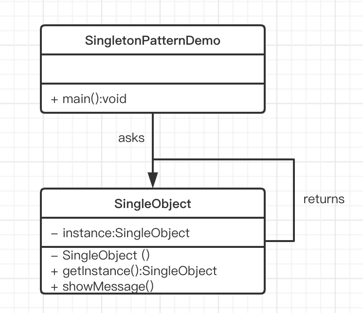

<!--
 * @Author: your name
 * @Date: 2020-03-29 16:02:50
 * @LastEditTime: 2020-03-29 16:53:22
 * @LastEditors: Please set LastEditors
 * @Description: In User Settings Edit
 * @FilePath: /Keep/articles/单例模式.md
 -->

# 单例模式

## 介绍

1. 系统中被唯一使用的
2. 一个类只有一个实例

## 示例

1. 登录框
2. 购物车
3. vuex和redux中的store

## UML类图



## 代码

```javascript
class SingleObject {
  login () {
    console.log('login...')
  }
}

SingleObject.getInstance = (function(){
  let instance
  return function() {
    if (!instance) {
      instance = new SingleObject()
    }
    return instance
  }
})()

let obj1 = SingleObject.getInstance()
obj1.login()
let obj2 = SingleObject.getInstance()
obj2.login()
console.log('obj1 === obj2', obj1 === obj2)
```

## 场景

1. jQuery只有一个$
2. 模拟登录框

```javascript
// jQuery只有一个$
if (window.jQuery != null) {
  return window.jQuery
} else {
  // 初始化
}
```

```javascript
class LoginForm {
  constructor () {
    this.state = 'hide'
  }
  show () {
    if (this.state === 'show') {
      alert('已经显示')
      return
    }
    this.state = 'show'
  }
  hide () {
    if (this.state === 'hide') {
      alert('已经隐藏')
      return
    }
    this.state = 'hide'
  }
}

LoginForm.getInstance = (function(){
  let instance
  return function() {
    if (!instance) {
      instance = new LoginForm()
    }
    return instance
  }
})()

let login1 = LoginForm.getInstance()
login1.show()

let login2 = LoginForm.getInstance()
login2.show()


class SingletonApple {
  constructor(name, creator, products) {
      this.name = name;
      this.creator = creator;
      this.products = products;
  }
  //静态方法
  static getInstance(name, creator, products) {
    if(!this.instance) {
      this.instance = new SingletonApple(name, creator, products);
    }
    return this.instance;
  }
}

let appleCompany = SingletonApple.getInstance('苹果公司', '乔布斯', ['iPhone', 'iMac', 'iPad', 'iPod']);
let copyApple = SingletonApple.getInstance('苹果公司', '阿辉', ['iPhone', 'iMac', 'iPad', 'iPod'])

console.log(appleCompany === copyApple); //true

```

## 设计原则验证

1. 符合单一职责原则，只实例化唯一的对象
2. 没法具体体现开放封闭原则，但绝对不违反开放封闭原则

## 总结

单例模式虽然简单，但是在项目中的应用场景却是相当多的，单例模式的核心是确保只有一个实例， 并提供全局访问。就像我们只需要一个浏览器的window对象, jQuery的$对象而不再需要第二个。 由于JavaScript代码书写方式十分灵活, 这也导致了如果没有严格的规范的情况下，大型的项目中JavaScript不利于多人协同开发， 使用单例模式进行命名空间，管理模块是一个很好的开发习惯，能够有效的解决协同开发变量冲突的问题。灵活使用单例模式，也能够减少不必要的内存开销，提高用于体验。
