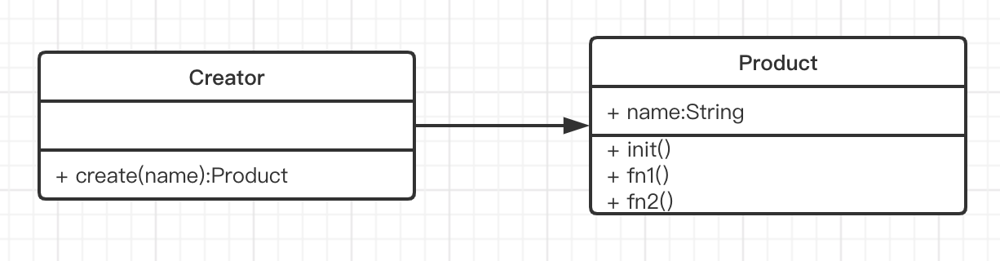

<!--
 * @Author: your name
 * @Date: 2020-03-29 12:04:35
 * @LastEditTime: 2020-03-29 16:01:39
 * @LastEditors: Please set LastEditors
 * @Description: In User Settings Edit
 * @FilePath: /Keep/articles/工厂模式.md
 -->

# 工厂模式

## 介绍

工厂模式，是用来创建对象的一种最常用的模式。不对外暴露创建对象的具体逻辑，将逻辑封装在一个函数中，这个函数可以被视作一个工厂。
我们可以将工厂方法看作是一个实例化对象的工厂类。



## 场景

`jquery - $('div')`

```javascript
class Jquery {
  constructor(selector) {
    let slice = Array.prototype.slice
    let dom = slice.call(document.querySelectorAll(selector))
    let len = dom ? dom.length : 0
    for (let i = 0; i < len; i++) {
      this[i]= dom[i]
    }
    this.length = len
    this.selector = selector || ''
  }
  append () {}
  addClass () {}
  html () {}
  // 省略一些api
}

window.$ = function(selector) {
  return new Jquery(selector)
}
```

`React.createElement`

`vue异步组件`

```javascript
Vue.component('async-example', function (resolve, reject) {
  setTimeout(function () {
    // 向 `resolve` 回调传递组件定义
    resolve({
      template: '<div>I am async!</div>'
    })
  }, 1000)
})
```

## 设计原则验证

1. 构造函数和创建者分离
2. 符合开放封闭原则

### 简单工厂模式

```javascript
let UserFactory = function (role) {
  function User(opt) {
    this.name = opt.name;
    this.viewPage = opt.viewPage;
  }

  switch (role) {
    case 'superAdmin':
      return new User({ name: '超级管理员', viewPage: ['首页', '通讯录', '发现页', '应用数据', '权限管理'] });
      break;
    case 'admin':
      return new User({ name: '管理员', viewPage: ['首页', '通讯录', '发现页', '应用数据'] });
      break;
    case 'user':
      return new User({ name: '普通用户', viewPage: ['首页', '通讯录', '发现页'] });
      break;
    default:
      throw new Error('参数错误, 可选参数:superAdmin、admin、user')
  }
}

//调用
let superAdmin = UserFactory('superAdmin');
let admin = UserFactory('admin');
let normalUser = UserFactory('user');

// es6方式
//User类
class User {
  //构造器
  constructor(opt) {
    this.name = opt.name;
    this.viewPage = opt.viewPage;
  }

  //静态方法
  static getInstance(role) {
    switch (role) {
      case 'superAdmin':
        return new User({ name: '超级管理员', viewPage: ['首页', '通讯录', '发现页', '应用数据', '权限管理'] });
        break;
      case 'admin':
        return new User({ name: '管理员', viewPage: ['首页', '通讯录', '发现页', '应用数据'] });
        break;
      case 'user':
        return new User({ name: '普通用户', viewPage: ['首页', '通讯录', '发现页'] });
        break;
      default:
        throw new Error('参数错误, 可选参数:superAdmin、admin、user')
    }
  }
}

//调用
let superAdmin = User.getInstance('superAdmin');
let admin = User.getInstance('admin');
let normalUser = User.getInstance('user');

```

简单工厂的优点在于，你只需要一个正确的参数，就可以获取到你所需要的对象，而无需知道其创建的具体细节。但是在函数内包含了所有对象的创建逻辑（构造函数）和判断逻辑的代码，每增加新的构造函数还需要修改判断逻辑代码。当我们的对象不是上面的3个而是30个或更多时，这个函数会成为一个庞大的超级函数，便得难以维护。所以，简单工厂只能作用于创建的对象数量较少，对象的创建逻辑不复杂时使用。

### 工厂方法模式

```javascript
//安全模式创建的工厂方法函数
let UserFactory = function(role) {
  if(this instanceof UserFactory) {
    var s = new this[role]();
    return s;
  } else {
    return new UserFactory(role);
  }
}

//工厂方法函数的原型中设置所有对象的构造函数
UserFactory.prototype = {
  SuperAdmin: function() {
    this.name = "超级管理员",
    this.viewPage = ['首页', '通讯录', '发现页', '应用数据', '权限管理']
  },
  Admin: function() {
    this.name = "管理员",
    this.viewPage = ['首页', '通讯录', '发现页', '应用数据']
  },
  NormalUser: function() {
    this.name = '普通用户',
    this.viewPage = ['首页', '通讯录', '发现页']
  }
}

//调用
let superAdmin = UserFactory('SuperAdmin');
let admin = UserFactory('Admin')
let normalUser = UserFactory('NormalUser')

// es6写法
class User {
  constructor(name = '', viewPage = []) {
    if(new.target === User) {
      throw new Error('抽象类不能实例化!');
    }
    this.name = name;
    this.viewPage = viewPage;
  }
}

class UserFactory extends User {
  constructor(name, viewPage) {
    super(name, viewPage)
  }
  create(role) {
    switch (role) {
      case 'superAdmin':
        return new UserFactory( '超级管理员', ['首页', '通讯录', '发现页', '应用数据', '权限管理'] );
        break;
      case 'admin':
        return new UserFactory( '普通用户', ['首页', '通讯录', '发现页'] );
        break;
      case 'user':
        return new UserFactory( '普通用户', ['首页', '通讯录', '发现页'] );
        break;
      default:
        throw new Error('参数错误, 可选参数:superAdmin、admin、user')
    }
  }
}

let userFactory = new UserFactory();
let superAdmin = userFactory.create('superAdmin');
let admin = userFactory.create('admin');
let user = userFactory.create('user');
```

### 抽象工厂模式

上面介绍了简单工厂模式和工厂方法模式都是直接生成实例，但是抽象工厂模式不同，抽象工厂模式并不直接生成实例， 而是用于对产品类簇的创建。

上面例子中的superAdmin，admin，user三种用户角色，其中user可能是使用不同的社交媒体账户进行注册的，例如：wechat，qq，weibo。那么这三类社交媒体账户就是对应的类簇。在抽象工厂中，类簇一般用父类定义，并在父类中定义一些抽象方法，再通过抽象工厂让子类继承父类。所以，抽象工厂其实是实现子类继承父类的方法。

上面提到的抽象方法是指声明但不能使用的方法。在其他传统面向对象的语言中常用abstract进行声明，但是在JavaScript中，abstract是属于保留字，但是我们可以通过在类的方法中抛出错误来模拟抽象类。

```javascript
let AccountAbstractFactory = function(subType, superType) {
  //判断抽象工厂中是否有该抽象类
  if(typeof AccountAbstractFactory[superType] === 'function') {
    //缓存类
    function F() {};
    //继承父类属性和方法
    F.prototype = new AccountAbstractFactory[superType] ();
    //将子类的constructor指向子类
    subType.constructor = subType;
    //子类原型继承父类
    subType.prototype = new F();

  } else {
    throw new Error('抽象类不存在!')
  }
}

//微信用户抽象类
AccountAbstractFactory.WechatUser = function() {
  this.type = 'wechat';
}
AccountAbstractFactory.WechatUser.prototype = {
  getName: function() {
    return new Error('抽象方法不能调用');
  }
}

//qq用户抽象类
AccountAbstractFactory.QqUser = function() {
  this.type = 'qq';
}
AccountAbstractFactory.QqUser.prototype = {
  getName: function() {
    return new Error('抽象方法不能调用');
  }
}

//新浪微博用户抽象类
AccountAbstractFactory.WeiboUser = function() {
  this.type = 'weibo';
}
AccountAbstractFactory.WeiboUser.prototype = {
  getName: function() {
    return new Error('抽象方法不能调用');
  }
}
```

AccountAbstractFactory就是一个抽象工厂方法，该方法在参数中传递子类和父类，在方法体内部实现了子类对父类的继承。对抽象工厂方法添加抽象类的方法我们是通过点语法进行添加的。

下面我们来定义普通用户的子类:

```javascript
//普通微信用户子类
function UserOfWechat(name) {
  this.name = name;
  this.viewPage = ['首页', '通讯录', '发现页']
}
//抽象工厂实现WechatUser类的继承
AccountAbstractFactory(UserOfWechat, 'WechatUser');
//子类中重写抽象方法
UserOfWechat.prototype.getName = function() {
  return this.name;
}

//普通qq用户子类
function UserOfQq(name) {
  this.name = name;
  this.viewPage = ['首页', '通讯录', '发现页']
}
//抽象工厂实现QqUser类的继承
AccountAbstractFactory(UserOfQq, 'QqUser');
//子类中重写抽象方法
UserOfQq.prototype.getName = function() {
  return this.name;
}

//普通微博用户子类
function UserOfWeibo(name) {
  this.name = name;
  this.viewPage = ['首页', '通讯录', '发现页']
}
//抽象工厂实现WeiboUser类的继承
AccountAbstractFactory(UserOfWeibo, 'WeiboUser');
//子类中重写抽象方法
UserOfWeibo.prototype.getName = function() {
  return this.name;
}


//实例化微信用户
let wechatUserA = new UserOfWechat('微信小李');
console.log(wechatUserA.getName(), wechatUserA.type); //微信小李 wechat
let wechatUserB = new UserOfWechat('微信小王');
console.log(wechatUserB.getName(), wechatUserB.type); //微信小王 wechat

//实例化qq用户
let qqUserA = new UserOfQq('QQ小李');
console.log(qqUserA.getName(), qqUserA.type); //QQ小李 qq
let qqUserB = new UserOfQq('QQ小王');
console.log(qqUserB.getName(), qqUserB.type); //QQ小王 qq

//实例化微博用户
let weiboUserA =new UserOfWeibo('微博小李');
console.log(weiboUserA.getName(), weiboUserA.type); //微博小李 weibo
let weiboUserB =new UserOfWeibo('微博小王');
console.log(weiboUserB.getName(), weiboUserB.type); //微博小王 weibo
```

上述代码我们分别定义了UserOfWechat，UserOfQq，UserOfWeibo三种类。这三个类作为子类通过抽象工厂方法实现继承。特别需要注意的是，调用抽象工厂方法后不要忘记重写抽象方法，否则在子类的实例中调用抽象方法会报错。

用es6重写抽象工厂模式：

```javascript
class User {
  constructor(type) {
    if (new.target === User) {
      throw new Error('抽象类不能实例化!')
    }
    this.type = type;
  }
}

class UserOfWechat extends User {
  constructor(name) {
    super('wechat');
    this.name = name;
    this.viewPage = ['首页', '通讯录', '发现页']
  }
}

class UserOfQq extends User {
  constructor(name) {
    super('qq');
    this.name = name;
    this.viewPage = ['首页', '通讯录', '发现页']
  }
}

class UserOfWeibo extends User {
  constructor(name) {
    super('weibo');
    this.name = name;
    this.viewPage = ['首页', '通讯录', '发现页']
  }
}

function getAbstractUserFactory(type) {
  switch (type) {
    case 'wechat':
      return UserOfWechat;
      break;
    case 'qq':
      return UserOfQq;
      break;
    case 'weibo':
      return UserOfWeibo;
      break;
    default:
      throw new Error('参数错误, 可选参数:superAdmin、admin、user')
  }
}

let WechatUserClass = getAbstractUserFactory('wechat');
let QqUserClass = getAbstractUserFactory('qq');
let WeiboUserClass = getAbstractUserFactory('weibo');

let wechatUser = new WechatUserClass('微信小李');
let qqUser = new QqUserClass('QQ小李');
let weiboUser = new WeiboUserClass('微博小李');
```
