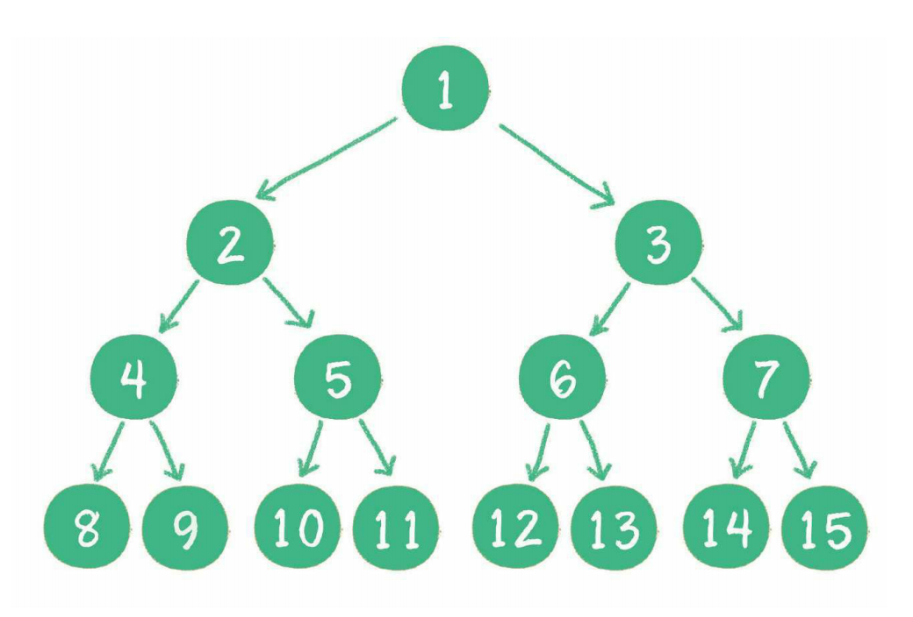
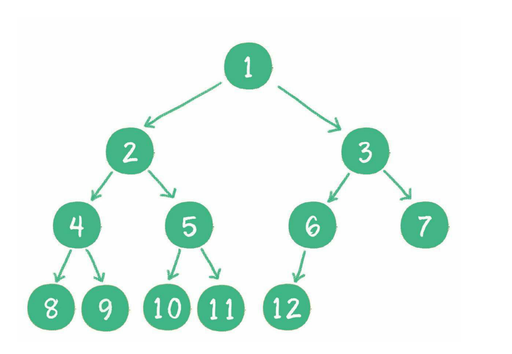
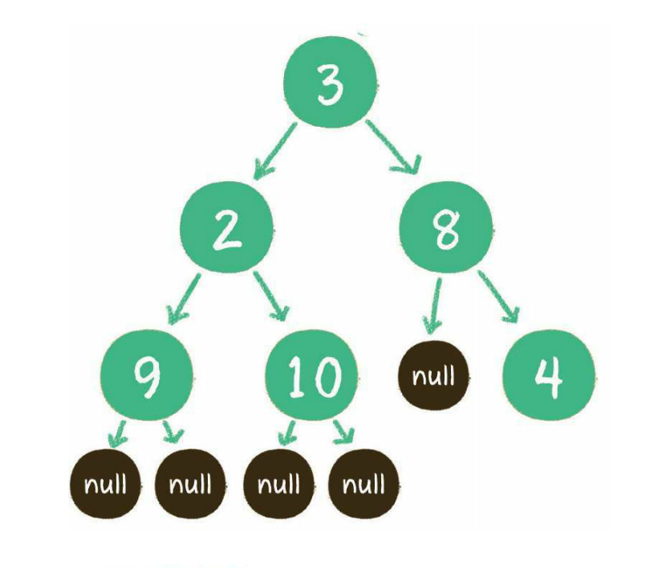
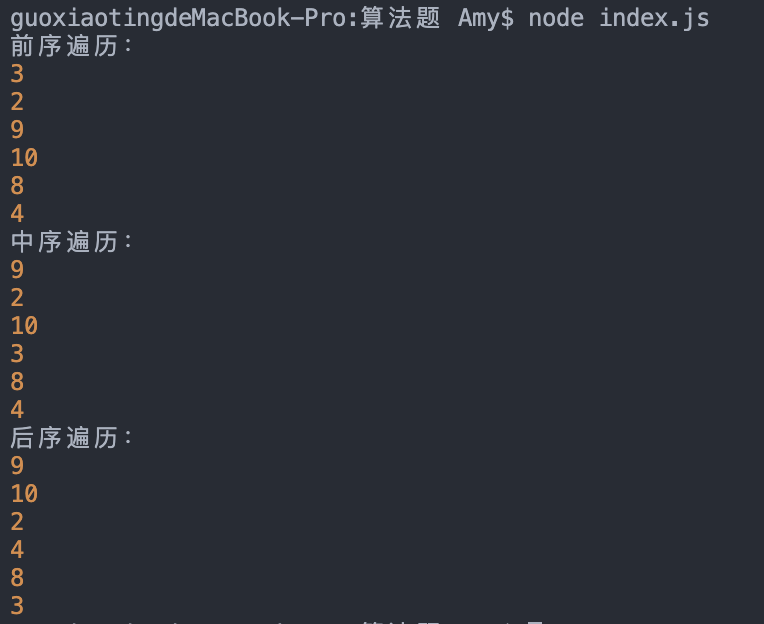

# 二叉树

二叉树的节点最多有两个孩子节点，左孩子和右孩子。

**满二叉树**：一个二叉树的所有非叶子节点都存在左右孩子，并且所有叶子节点都在 同一层级上，那么这个树就是满二叉树。



**完全二叉树**：对一个有n个节点的二叉树，按层级顺序编号，则所有节点的编号为从1到n。如果这个树所有节点和同样深度的满二叉树的编号为从1到n的节点位置相同，则这个二叉树为完全二叉树。



## 节点的定义

```javascript
class TreeNode {
  static val
  static left
  static right

  constructor (val) {
    this.val = val
  }

  isLeave () {
    return this.left === null && this.right === null
  }
}
```

## 遍历

### 深度优先遍历

* 前序遍历
* 中序遍历
* 后序遍历

#### 递归实现

```javascript
// 节点定义
class TreeNode {
  static val
  static left = null
  static right = null

  constructor (val) {
    this.val = val
  }

  isLeave () {
    return this.left === null && this.right === null
  }
}

// 前序遍历: 根节点->左孩子->右孩子
function preOrderTraveral (root) {
  if (root === null) return
  console.log(root.val)
  preOrderTraveral(root.left)
  preOrderTraveral(root.right)
}

// 中序遍历: 左孩子->根节点->右孩子
function inOrderTraveral (root) {
  if (root === null) return
  inOrderTraveral(root.left)
  console.log(root.val)
  inOrderTraveral(root.right)
}

// 后序遍历: 左孩子->右孩子->根节点
function postOrderTraveral (root) {
  if (root === null) return
  postOrderTraveral(root.left)
  postOrderTraveral(root.right)
  console.log(root.val)
}

// 构建二叉树
function createBinaryTree (list) {
  let treeNode = null
  if (list === null || list.length === 0) {
    return null
  }
  let data = list.shift()
  // 链表节点的顺序恰恰是二叉树前序遍历的顺序，这里构建二叉树的顺序是前序遍历的顺序
  if (data) {
    treeNode = new TreeNode(data)
    treeNode.left = createBinaryTree(list)
    treeNode.right = createBinaryTree(list)
  }
  return treeNode
}

function main () {
  let list = [3,2,9,null,null,10,null,null,8,null,4]
  let treeNode = createBinaryTree(list)
  console.log('前序遍历：')
  preOrderTraveral(treeNode)
  console.log('中序遍历：')
  inOrderTraveral(treeNode)
  console.log('后序遍历：')
  postOrderTraveral(treeNode)
}

main()
```




上述我们用递归的方式遍历二叉树，我们知道，绝大多数可以用递归解决的问题，其实都可以用另一种数据结构来解决，这种数据结构就是栈（因为递归和栈都有回溯的特性），所以我们可以尝试用非递归的方式遍历二叉树。

```javascript
// 前序遍历写法1
function preOrderTraveral (root) {
  if (root === null) return
  let stack = []
  let treeNode = root
  while (treeNode || stack.length) {
    // 迭代访问节点的左孩子，并入栈
    while (treeNode) {
      console.log(treeNode.val)
      // 节点入栈
      stack.push(treeNode)
      treeNode = treeNode.left
    }
    // 如果节点没有左孩子，那么弹出栈顶元素，并访问它的右孩子，如果右孩子还是空，则再弹出栈顶元素，直到访问到右孩子
    if (stack.length) {
      treeNode = stack.pop()
      treeNode = treeNode.right
    }
  }
}

// 前序遍历的另一种写法
function preOrderTraveral (root) {
  let stack = []
  stack.push(root)
  while (stack.length) {
    let treeNode = stack.pop()
    console.log(treeNode.val)
    treeNode.right && stack.push(treeNode.right)
    treeNode.left && stack.push(treeNode.left)
  }
}

```

```javascript
// 中序遍历
function inOrderTraveral (root) {
  if (root === null) return
  let stack = []
  let treeNode = root
  while (treeNode || stack.length) {
    // 迭代访问节点的左孩子，并入栈
    while (treeNode) {
      // 节点入栈
      stack.push(treeNode)
      treeNode = treeNode.left
    }
    // 如果节点没有左孩子，那么弹出栈顶元素，并访问它的右孩子，如果右孩子还是空，则再弹出栈顶元素，直到访问到右孩子
    if (stack.length) {
      treeNode = stack.pop()
      console.log(treeNode.val)
      treeNode = treeNode.right
    }
  }
}
```

```javascript
// 后序遍历
function postOrderTraveral (root) {
  if (root === null) return
  let stack = []
  stack.push(root)
  let prev = null // 前一个访问的元素
  while (stack.length) {
    let top = stack[stack.length - 1] // 栈顶元素
    // 如果栈顶节点是叶子节点或者上一次访问的节点是top节点的左孩子或右孩子，则弹出栈顶节点并访问
    if (top.isLeave() || (top.left === prev || top.right === prev)) {
      console.log(top.val)
      prev = stack.pop()
    } else {
      // 将栈顶节点的右孩子和左孩子先后入栈
      top.right && stack.push(top.right)
      top.left && stack.push(top.left)
    }
  }
}
```

### 广度优先遍历

利用队列将同一层的节点保存起来然后访问，在访问的同时将下一层的节点也入队列。

```javascript
function levelOrderTraversal (root) {
  if (!root) return
  let queue = []
  queue.push(root)
  while (queue.length) {
    let treeNode = queue.shift()
    console.log(treeNode.val)
    treeNode.left && queue.push(treeNode.left)
    treeNode.right && queue.push(treeNode.right)
  }
}
```
