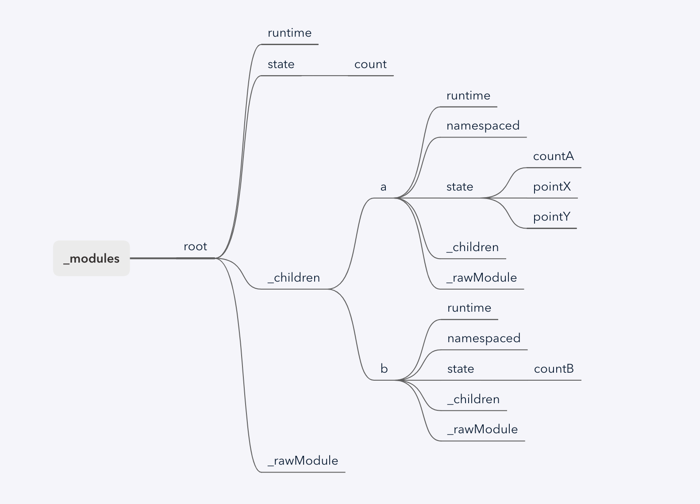
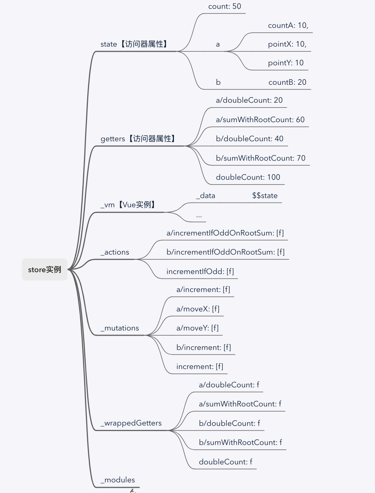

# vuex api

## 回顾一下vuex store初始化过程

以下面代码为例子，回顾一下store的初始化过程，有兴趣可以粘贴这段代码debugger一下。

```javascript
import Vue from 'vue'
import Vuex from 'vuex'
import App from './App.vue'

Vue.use(Vuex)

Vue.config.productionTip = false

const moduleA = {
  namespaced: true,
  state: () => ({
    countA: 10,
    pointX: 10,
    pointY: 10
  }),
  mutations: {
    increment (state) {
      state.countA++
    },
    moveX (state, step) {
      state.pointX += step
    },
    moveY (state, step) {
      state.pointY += step
    }
  },
  actions: {
    incrementIfOddOnRootSum ({ state, commit, rootState }) {
      if ((state.countA + rootState.count) % 2 === 1) {
        commit('increment')
      }
    }
  },
  getters: {
    doubleCount (state) {
      return state.countA * 2
    },
    sumWithRootCount (state, getters, rootState) {
      return state.countA + rootState.count
    }
  }
}

const moduleB = {
  namespaced: true,
  state: () => ({
    countB: 20
  }),
  mutations: {
    increment (state) {
      state.countB++
    }
  },
  actions: {
    incrementIfOddOnRootSum ({ state, commit, rootState }) {
      if ((state.countB + rootState.count) % 2 === 1) {
        commit('increment')
      }
    }
  },
  getters: {
    doubleCount (state) {
      return state.countB * 2
    },
    sumWithRootCount (state, getters, rootState) {
      return state.countB + rootState.count
    }
  }
}

const store = new Vuex.Store({
  modules: {
    a: moduleA,
    b: moduleB
  },
  state: {
    count: 50
  },
  mutations: {
    increment (state) {
      state.count++
    }
  },
  actions: {
    incrementIfOdd ({ state, commit}) {
      if (state.count % 2 === 1) {
        commit('increment')
      }
    }
  },
  getters: {
    doubleCount (state) {
      return state.count * 2
    }
  }
})

new Vue({
  // 把 store 对象提供给 “store” 选项，这可以把 store 的实例注入所有的子组件
  store,
  render: h => h(App),
}).$mount('#app')
```

*第一步*，`this._modules = new ModuleCollection(options)`，初始化_modules，将modules组成一个树形结构。

如上例，形成的树形结构如下：

```javascript
this._modules = {
  runtime: false,
  state: {
    count: 50
  },
  _children: {
    a: {
      namespaced: true,
      runtime: false,
      state: {
        countA: 10
        pointX: 10
        pointY: 10
      },
      _children: {},
      _rawModule: {
        namespaced: true,
        state: () => ({
          countA: 10,
          pointX: 10,
          pointY: 10
        }),
        mutations: {
          increment (state) {
            state.countA++
          },
          moveX (state, step) {
            state.pointX += step
          },
          moveY (state, step) {
            state.pointY += step
          }
        },
        actions: {
          incrementIfOddOnRootSum ({ state, commit, rootState }) {
            if ((state.countA + rootState.count) % 2 === 1) {
              commit('increment')
            }
          }
        },
        getters: {
          doubleCount (state) {
            return state.countA * 2
          },
          sumWithRootCount (state, getters, rootState) {
            return state.countA + rootState.count
          }
        }
      }
    },
    b: {
      namespaced: true,
      runtime: false,
      state: {
        countB: 20
      },
      _children: {},
      _rawModule: {
        namespaced: true,
        state: () => ({
          countB: 20
        }),
        mutations: {
          increment (state) {
            state.countB++
          }
        },
        actions: {
          incrementIfOddOnRootSum ({ state, commit, rootState }) {
            if ((state.countB + rootState.count) % 2 === 1) {
              commit('increment')
            }
          }
        },
        getters: {
          doubleCount (state) {
            return state.countB * 2
          },
          sumWithRootCount (state, getters, rootState) {
            return state.countB + rootState.count
          }
        }
      }
    }
  },
  _rawModule: {
    modules: {
      a: {
        // 这里省略子模块moduleA中的具体内容
        namespaced: true,
        state: () => ({ ... }),
        mutations: { ... },
        actions: { ... },
        getters: { ... }
      },
      b: {
        // 这里省略子模块moduleB中的具体内容
        namespaced: true,
        state: () => ({ ... }),
        mutations: { ... },
        actions: { ... },
        getters: { ... }
      }
    },
    state: {
      count: 50
    },
    mutations: {
      increment (state) {
        state.count++
      }
    },
    actions: {
      incrementIfOddOnRootSum ({ state, commit, rootState }) {
        if ((state.countA + rootState.count) % 2 === 1) {
          commit('increment')
        }
      }
    },
    getters: {
      doubleCount (state) {
        return state.countA * 2
      },
      sumWithRootCount (state, getters, rootState) {
        return state.countA + rootState.count
      }
    }
  }
}
```



*第二步*，根据初始化的模块树（_modules），递归的去安装所有的模块。安装模块的结果实际上就是对之前定义的_actions、_mutations、_wrappedGetters做初始化。同时，对模块树_modules.state，会设置上所有子模块的state。

```javascript
// store internal state
this._actions = Object.create(null);
this._mutations = Object.create(null);
this._wrappedGetters = Object.create(null);
this._modules = new ModuleCollection(options);

// init root module.
// this also recursively registers all sub-modules
// and collects all module getters inside this._wrappedGetters
installModule(this, state, [], this._modules.root);
```

在安装模块后的store实例：

```javascript
// store 实例
const store = {
  _actions: {
    'a/incrementIfOddOnRootSum': [f],
    'b/incrementIfOddOnRootSum': [f],
    'incrementIfOdd': [f]
  },
  _mutations: {
    'b/increment': [f],
    'a/moveY': [f],
    'a/moveX': [f],
    'a/increment': [f],
    'increment': [f]
  },
  _wrappedGetters: {
    'a/doubleCount': function wrappedGetter (store) {},
    'a/sumWithRootCount': function wrappedGetter (store) {},
    'b/doubleCount': function wrappedGetter (store) {},
    'b/sumWithRootCount': function wrappedGetter (store) {},
    'doubleCount': function wrappedGetter (store) {
      return rawGetter(
        local.state, // local state
        local.getters, // local getters
        store.state, // root state
        store.getters // root getters
      )
    }
  },
  _modules: {
    state: {
      count: 50,
      a: {
        countA: 10,
        pointX: 10,
        pointY: 10
      },
      b: {
        countB: 20
      }
    },
    runtime: false,
    _children: {...},
    _rawModule: {...}
  }
}

// 如果是moduleA、moduleB的namespaced为false，没有命名空间的情况下
const store = {
  _actions: {
    'incrementIfOddOnRootSum': [f, f],
    'incrementIfOdd': [f]
  },
  _mutations: {
    'moveY': [f],
    'moveX': [f],
    'increment': [f, f, f]
  },
  _wrappedGetters: {
    'sumWithRootCount': function wrappedGetter (store) {},
    'doubleCount': function wrappedGetter (store) {}
  },
  ...
}
```

*第三步*，初始化store._vm，实例化Vue，建立state和getters的依赖关系，将state、getters变成响应式数据。

```javascript
// initialize the store vm, which is responsible for the reactivity
// (also registers _wrappedGetters as computed properties)
resetStoreVM(this, state);

function resetStoreVM (store, state, hot) {
  var oldVm = store._vm;

  // bind store public getters
  store.getters = {};
  // reset local getters cache
  store._makeLocalGettersCache = Object.create(null);
  var wrappedGetters = store._wrappedGetters;
  var computed = {};
  forEachValue(wrappedGetters, function (fn, key) {
    // use computed to leverage its lazy-caching mechanism
    // direct inline function use will lead to closure preserving oldVm.
    // using partial to return function with only arguments preserved in closure environment.
    computed[key] = partial(fn, store);
    Object.defineProperty(store.getters, key, {
      get: function () { return store._vm[key]; },
      enumerable: true // for local getters
    });
  });

  // use a Vue instance to store the state tree
  // suppress warnings just in case the user has added
  // some funky global mixins
  var silent = Vue.config.silent;
  Vue.config.silent = true;
  store._vm = new Vue({
    data: {
      $$state: state
    },
    computed: computed
  });
  Vue.config.silent = silent;

  // enable strict mode for new vm
  if (store.strict) {
    enableStrictMode(store);
  }

  if (oldVm) {
    if (hot) {
      // dispatch changes in all subscribed watchers
      // to force getter re-evaluation for hot reloading.
      store._withCommit(function () {
        oldVm._data.$$state = null;
      });
    }
    Vue.nextTick(function () { return oldVm.$destroy(); });
  }
}
```

通过定义一个Vue实例对store._vm进行初始化，建立响应式数据，getters作为computed属性进行读取。

初始化store._vm后，store实例如下：

```javascript
// store 实例
const store = {
  _actions: {
    'a/incrementIfOddOnRootSum': [f],
    'b/incrementIfOddOnRootSum': [f],
    'incrementIfOdd': [f]
  },
  _mutations: {
    'b/increment': [f],
    'a/moveY': [f],
    'a/moveX': [f],
    'a/increment': [f],
    'increment': [f]
  },
  _wrappedGetters: {
    'a/doubleCount': function wrappedGetter (store) {},
    'a/sumWithRootCount': function wrappedGetter (store) {},
    'b/doubleCount': function wrappedGetter (store) {},
    'b/sumWithRootCount': function wrappedGetter (store) {},
    'doubleCount': function wrappedGetter (store) {
      return rawGetter(
        local.state, // local state
        local.getters, // local getters
        store.state, // root state
        store.getters // root getters
      )
    }
  },
  _modules: {
    state: {
      count: 50,
      a: {
        countA: 10,
        pointX: 10,
        pointY: 10
      },
      b: {
        countB: 20
      }
    },
    runtime: false,
    _children: {...},
    _rawModule: {...}
  },
  getters: { // 访问器属性
    'a/doubleCount': 20
    'a/sumWithRootCount': 60
    'b/doubleCount': 40
    'b/sumWithRootCount': 70
    'doubleCount': 100
  },
  state: { // 访问器属性
    count: 50,
    a: {
      countA: 10,
      pointX: 10,
      pointY: 10
    },
    b: {
      countB: 20
    }
  },
  _vm: { // vue实例
    $vnode: undefined,
    _data: {
      $$state: {
        count: 50,
        a: {
          countA: 10,
          pointX: 10,
          pointY: 10
        },
        b: {
          countB: 20
        }
      }
    },
    ...
  }
}
```

至此，数据仓库构造完毕，store初始化完成。store实例的部分数据属性如下图：



构造好这个`store`后，vuex提供了一些API对数据进行存取操作，进入本篇正题。

## 数据读取

### 读取state中的数据

```javascript
get state () {
  return this._vm._data.$$state
}

function resetStoreVM (store, state, hot) {
  // ...
  store._vm = new Vue({
    data: {
      $$state: state // 此处传入的state是`root state`
    },
    computed: computed
  });
  // ...
}
```

`root state`在vuex初始化安装模块递归执行`installModule`时已经完成构建，所有子模块的state都会整合到`root state`中。

```javascript
function installModule (store, rootState, path, module, hot) {

  // ...

  // set state 构建整颗state树
  if (!isRoot && !hot) {
    const parentState = getNestedState(rootState, path.slice(0, -1)) // 找到父模块state对象
    const moduleName = path[path.length - 1]
    store._withCommit(() => {
      if (__DEV__) {
        if (moduleName in parentState) {
          console.warn(
            `[vuex] state field "${moduleName}" was overridden by a module with the same name at "${path.join('.')}"`
          )
        }
      }
      // 设置子模块state：子模块名称为key，子模块state对象为value
      Vue.set(parentState, moduleName, module.state)
    })
  }
}
```

当通过`store.state.count`读取数据时，返回`this._vm._data.$$state`，也就是`store._vm._data.$$state.count`

当要访问子模块的state时，如`store.state.countA`是访问不到的，前面需要加上子模块名称'a'`store.state.a.countA`。访问`store.state.a.countA`就是访问`store._vm._data.$$state.a.countA`

### 读取getters中数据

`getter`可以认为是`store`中的计算属性，`getter`的返回值会根据它的依赖被缓存起来，且只有当它的依赖值发生了改变才会被重新计算。

```javascript
function resetStoreVM (store, state, hot) {

  // ...

  var wrappedGetters = store._wrappedGetters;
  var computed = {};
  forEachValue(wrappedGetters, function (fn, key) {
    // use computed to leverage its lazy-caching mechanism
    // direct inline function use will lead to closure preserving oldVm.
    // using partial to return function with only arguments preserved in closure environment.
    computed[key] = partial(fn, store);
    Object.defineProperty(store.getters, key, {
      get: function () { return store._vm[key]; },
      enumerable: true // for local getters
    });
  });

  // ...

  store._vm = new Vue({
    data: {
      $$state: state
    },
    computed: computed
  });

  //...
}
```

```javascript
getters: {
  doubleCount (state) {
    return state.count * 2
  }
}
```

通过属性访问，访问`store.getters.doubleCount`，也就是访问`store._vm['doubleCount']`，`doubleCount`作为vue实例的计算属性被访问，会执行`partial(fn, store)`得到值。`partial(fn, store)`即执行_wrappedGetters中对应key为`doubleCount`的getter方法。

回头看一下_wrappedGetters中返回rawGetter，rawGetter就是我们自定义的getter方法，可以传入四个参数，除了全局的state和getter外，我们还可以访问到当前module下的state和getter。

```javascript
function registerGetter (store, type, rawGetter, local) {
  if (store._wrappedGetters[type]) {
    if (__DEV__) {
      console.error(`[vuex] duplicate getter key: ${type}`)
    }
    return
  }
  store._wrappedGetters[type] = function wrappedGetter (store) {
    return rawGetter(
      local.state, // local state
      local.getters, // local getters
      store.state, // root state
      store.getters // root getters
    )
  }
}
```

由此可见，如果想通过属性访问有命名空间的子模块下的getter数据，就需要这么写`store.getters['a/sumWithRootCount']`。

## 数据存储

更改Vuex的store中的状态的唯一方法是提交mutation。每个 mutation都有一个字符串的事件类型 (type)和一个回调函数 (handler)。这个回调函数就是我们实际进行状态更改的地方，并且它会接受 state 作为第一个参数：

```javascript
// ...
mutations: {
  increment (state, payload) {
    state.count++
  }
},
//...
```

当要调用这个`increment`函数时，你需要调用 store.commit 方法：

```javascript
store.commit('increment', payload)
```

下面看一下commit方法的实现

```javascript
commit (_type, _payload, _options) {
  // check object-style commit
  const {
    type,
    payload,
    options
  } = unifyObjectStyle(_type, _payload, _options)

  const mutation = { type, payload }
  const entry = this._mutations[type]
  if (!entry) {
    if (__DEV__) {
      console.error(`[vuex] unknown mutation type: ${type}`)
    }
    return
  }
  this._withCommit(() => {
    entry.forEach(function commitIterator (handler) {
      handler(payload)
    })
  })

  this._subscribers
    .slice() // shallow copy to prevent iterator invalidation if subscriber synchronously calls unsubscribe
    .forEach(sub => sub(mutation, this.state))

  if (
    __DEV__ &&
    options && options.silent
  ) {
    console.warn(
      `[vuex] mutation type: ${type}. Silent option has been removed. ` +
      'Use the filter functionality in the vue-devtools'
    )
  }
}
```

`unifyObjectStyle`对参数进行处理，第一个参数支持传入对象。

```javascript
// commit支持对象风格的提交方式
store.commit({
  type: 'increment',
  amount: 10
})

function unifyObjectStyle (type, payload, options) {
  // 整个对象都作为载荷传给 mutation 函数
  if (isObject(type) && type.type) {
    options = payload
    payload = type
    type = type.type
  }

  if (__DEV__) {
    assert(typeof type === 'string', `expects string as the type, but found ${typeof type}.`)
  }

  return { type, payload, options }
}
```

读完store初始化后，我们知道_mutations中存储了所有模块的mutation函数，以数组的形式存储，有命名空间的子模块对应的key会加上模块命名空间的前缀。

```javascript
const mutation = { type, payload }
const entry = this._mutations[type]
// 没有找到该type的对应函数数组
if (!entry) {
  if (__DEV__) {
    console.error(`[vuex] unknown mutation type: ${type}`)
  }
  return
}
this._withCommit(() => {
  entry.forEach(function commitIterator (handler) {
    handler(payload)
  })
})
```

根据传入的type，在_mutations中找到对应的函数数组`entry`，遍历获取到每个handler并执行，这里的handler就是我们自定义的mutation方法，该方法可以传入两个参数，第一个是当前模块的state`local.state`, 第二个是payload。

```javascript
// 这里传入的handler是我们自定义的mutation函数
function registerMutation (store, type, handler, local) {
  const entry = store._mutations[type] || (store._mutations[type] = [])
  entry.push(function wrappedMutationHandler (payload) {
    handler.call(store, local.state, payload)
  })
}
```

----
我们看到entry遍历外层包了_withCommit方法，`this._withCommit`的作用，看下面两段代码：

```javascript
if (store.strict) {
  enableStrictMode(store)
}

function enableStrictMode (store) {
  store._vm.$watch(function () { return this._data.$$state }, () => {
    if (process.env.NODE_ENV !== 'production') {
      assert(store._committing, `Do not mutate vuex store state outside mutation handlers.`)
    }
  }, { deep: true, sync: true })
}
```

```javascript
_withCommit (fn) {
  const committing = this._committing
  this._committing = true
  fn()
  this._committing = committing
}
```

`_withCommit`就是对 fn 包装了一个环境，确保在 fn 中执行任何逻辑的时候 this._committing = true。

如果设置为严格模式`store.strict = true`，那么`store._vm`会添加一个 wathcer来观测`this._data.$$state`的变化，也就是当`store.state`被修改的时候, `store._committing`必须为`true`，否则在开发阶段会报警告。

所以`_withCommit`的作用就是确保严格模式下在执行自定义的mutation方法时不会报警告。

----

