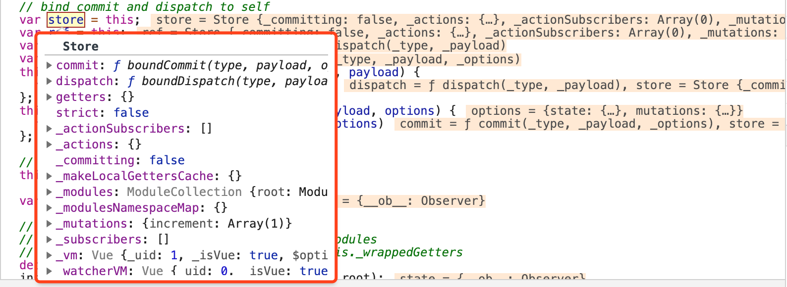

# vuex源码解析之store初始化

我们知道，vuex是一个专门为vuejs设计的状态管理器。它可以集中存储所有组件的状态，让兄弟组件或多层嵌套组件之间的传值变得简单。vuex以全局单例模式管理着所有组件的状态和一些触发状态变化的行为，本篇从源码上详解vuex是如何设计这个store单例，也就是store类实例化的过程。

下面看一个最简单的例子：

```javascript
import Vue from 'vue'
import Vuex from 'vuex'

Vue.use(Vuex)

const store = new Vuex.Store({
  state: {
    count: 0
  },
  mutations: {
    increment (state) {
      state.count++
    }
  }
})
```

它最终形成的初始化的store实例对象如下图：


可以看到形成的store对象中保存了commit、dispatch两个方法和getters、_actions、_mutations、_modules、_modulesNamespaceMap等等属性。下面我们看一下vuex是如何定义这些属性与方法的。

看一下store构造函数，它接收一个对象参数，里面包含actions、getters、state、mutations、modules等Vuex的核心概念。

```javascript
export class Store {
  constructor (options = {}) {
    // Auto install if it is not done yet and `window` has `Vue`.
    // To allow users to avoid auto-installation in some cases,
    // this code should be placed here. See #731
    if (!Vue && typeof window !== 'undefined' && window.Vue) {
      install(window.Vue)
    }

    // ...

    const {
      plugins = [],
      strict = false
    } = options

    // store internal state
    this._committing = false
    this._actions = Object.create(null)
    this._actionSubscribers = [] // 订阅actions变化的订阅者
    this._mutations = Object.create(null)
    this._wrappedGetters = Object.create(null)
    this._modules = new ModuleCollection(options) // 初始化modules。构建一个modules树。
    this._modulesNamespaceMap = Object.create(null)
    this._subscribers = [] // 订阅mutations变化的订阅者
    this._watcherVM = new Vue()
    this._makeLocalGettersCache = Object.create(null)

    // bind commit and dispatch to self
    const store = this
    const { dispatch, commit } = this
    this.dispatch = function boundDispatch (type, payload) {
      return dispatch.call(store, type, payload)
    } // 执行this.dispatch时，保证dispatch上下文是store
    this.commit = function boundCommit (type, payload, options) {
      return commit.call(store, type, payload, options)
    }

    // strict mode
    this.strict = strict

    const state = this._modules.root.state
    // 安装模块
    installModule(this, state, [], this._modules.root)
    // getters和state建立依赖关系，变成响应式
    resetStoreVM(this, state)

    // apply plugins
    plugins.forEach(plugin => plugin(this))

    const useDevtools = options.devtools !== undefined ? options.devtools : Vue.config.devtools
    if (useDevtools) {
      devtoolPlugin(this)
    }
  }
  ...
}
```

以上构造函数逻辑，我们会重点关注到三个点：

1. `this._modules = new ModuleCollection(options)`：modules初始化模块，形成一棵modules树，最终会存储在图1的_modules属性中.
2. `installModule(this, state, [], this._modules.root)`：安装模块
3. resetStoreVM `resetStoreVM(this, state)`：初始化store._vm

### 初始化模块

假设我们定义了下面这个store，这个store中包含了一个根模块和两个子模块moduleA和moduleB。

```javascript
const moduleA = {
  state: { c: 2 },
  mutations: { ... },
  actions: { ... },
  getters: { ... }
}

const moduleB = {
  state: { d: 4 },
  mutations: { ... },
  actions: { ... },
  getters: { ... },
}

const store = new Vuex.Store({
  modules: {
    a: moduleA,
    b: moduleB
  },
  state: {
    kk: 1
  },
  mutations: {...},
  actions: {...},
  getters: {...}
})
```

那么通过new ModuleCollection形成的模块树数据结构如下：

```javascript
const tree = {
  runtime: false,
  _children: {
    a: {
      runtime: false,
      _children: {},
      _rawModule: {
        state: {
          c: 2
        },
        mutations: { ... },
        actions: { ... },
        getters: { ... }
      },
      state: {
        c: 2
      }
    },
    b: {
      runtime: false,
      _children: {},
      _rawModule: {
        state: {
          d: 4
        },
        mutations: { ... },
        actions: { ... },
        getters: { ... }
      },
      state: {
        d: 4
      }
    }
  }, // 存储子modules
  _rawModule: {
    modules: {
      a: moduleA,
      b: moduleB
    },
    state: {
      kk: 1
    },
    mutations: {...},
    actions: {...},
    getters: {...}
  }, // 原始的module（root module (Vuex.Store options)）
  state: {
    kk: 1
  }, // rawModule.state
  namespace: false
}
```

vuex中通过构造两个类来形成模块树

* 模块树类`ModuleCollection`【用来组建树形结构的类】
* 模块类`Module`【用来描述单个模块的类】

看一下ModuleCollection类的实现：

```javascript
export default class ModuleCollection {
  constructor (rawRootModule) {  // rawRootModule ==> options
    // register root module (Vuex.Store options)
    this.register([], rawRootModule, false)
  }
  ...
}
```

第一步，注册根模块节点。

```javascript
export default class ModuleCollection {

  ...

  register (path, rawModule, runtime = true) {
    if (__DEV__) {
      assertRawModule(path, rawModule)
    }

    // 创建了一个 Module 的实例
    // Module 是用来描述单个模块的类
    const newModule = new Module(rawModule, runtime)
    if (path.length === 0) {
      // 根模块
      this.root = newModule
    } else {
      // 父module和子module建立父子关系
      const parent = this.get(path.slice(0, -1))
      //  ==> this.get([])
      // parent ==> this.root 根module
      parent.addChild(path[path.length - 1], newModule)
      // root.addChild('a', a对应的module实例对象)
    }

    // register nested modules 递归注册嵌套的module
    if (rawModule.modules) { // rawModule.modules ==> {a: {...}, b: {...}}
      forEachValue(rawModule.modules, (rawChildModule, key) => {
        // 注册子模块 a、b
        this.register(path.concat(key), rawChildModule, runtime)
      })
    }
  }
}
```

第二步，如果有子模块，首先根据路径获取到父模块，然后再调用父模块的 addChild 方法建立父子关系。

```javascript
const parent = this.get(path.slice(0, -1))
parent.addChild(path[path.length - 1], newModule)
```

* get函数：根据path找到当前模块的父模块。

```javascript
export default class ModuleCollection {
  ...
  get (path) {
    return path.reduce((module, key) => {
      return module.getChild(key)
    }, this.root)
  }
  // 根据path找到当前模块的父模块。
}
```

* 调用父模块的addChild方法（定义在单个模块类（module）的addChild方法）

```javascript
export default class Module {
  constructor (rawModule, runtime) {
    this.runtime = runtime
    // Store some children item
    this._children = Object.create(null)
    // Store the origin module object which passed by programmer
    this._rawModule = rawModule
    const rawState = rawModule.state

    // Store the origin module's state
    this.state = (typeof rawState === 'function' ? rawState() : rawState) || {}
  }

  ...

  addChild (key, module) {
    this._children[key] = module // this._children['a'] = 子module实例对象
  }

  ...
}

```

第三步，遍历当前模块定义中的所有modules，把模块的key作为path，递归调用register方法。

```javascript
if (rawModule.modules) { // rawModule.modules ==> {a: {...}, b: {...}}
  forEachValue(rawModule.modules, (rawChildModule, key) => {
    // 注册子模块 a、b
    this.register(path.concat(key), rawChildModule, runtime)
  })
}
```

总的来说，对于根模块root module的下一层modules来说，它们的parent就是root module，那么他们就会被添加的root module的 _children中。每个子模块通过路径找到它的父模块，然后通过父模块的addChild方法建立父子关系，递归执行这样的过程，最终就建立一颗完整的模块树。
那么，我们形成这棵模块树的作用是什么呢？答案是我们要根据模块树来安装模块，在store对象上注册actions,mutations和getters。下面我们就看一下如果安装模块。

### 安装模块

安装模块也就是函数installModule的执行过程，它将遍历module树，给_acitons、_mutations、_wrappedGetters赋值，完成模块下的state、getters、actions、mutations的初始化工作，并且通过递归遍历的方式，就完成了所有子模块的安装工作。

```javascript
function installModule (store, rootState, path, module, hot) {
  const isRoot = !path.length
  const namespace = store._modules.getNamespace(path) // 生成当前路径（当前模块）的namespace字段：如果是根模块，namespace就是‘’，如果是子模块的就是模块key+'/'，如果'a/'。

  // register in namespace map
  if (module.namespaced) {
    if (store._modulesNamespaceMap[namespace] && __DEV__) {
      console.error(`[vuex] duplicate namespace ${namespace} for the namespaced module ${path.join('/')}`)
    }
    store._modulesNamespaceMap[namespace] = module
  } // 生成一个_modulesNamespaceMap, namespace为key, 对应模块对象为value

  // set state
  if (!isRoot && !hot) {
    const parentState = getNestedState(rootState, path.slice(0, -1))  // 获取当前模块的父state对象
    const moduleName = path[path.length - 1]
    store._withCommit(() => {
      if (__DEV__) {
        if (moduleName in parentState) {
          console.warn(
            `[vuex] state field "${moduleName}" was overridden by a module with the same name at "${path.join('.')}"`
          )
        }
      }
      Vue.set(parentState, moduleName, module.state)
    })
  }

  const local = module.context = makeLocalContext(store, namespace, path)  // 构造一个本地上下文环境，返回一个local对象【里面重写了dispatch、commit，代理了getters、state】

  module.forEachMutation((mutation, key) => {
    const namespacedType = namespace + key
    registerMutation(store, namespacedType, mutation, local)
  })

  module.forEachAction((action, key) => {
    const type = action.root ? key : namespace + key
    const handler = action.handler || action
    registerAction(store, type, handler, local)
  })

  module.forEachGetter((getter, key) => {
    const namespacedType = namespace + key
    registerGetter(store, namespacedType, getter, local)
  })

  module.forEachChild((child, key) => {
    installModule(store, rootState, path.concat(key), child, hot)
  })
}
```

#### makeLocalContext

构建一个local上下文对象，在registerMutation、registerAction、registerGetter中需要传入。这里为了保证有命名空间的模块注册时调用其本地上下文环境的dispatch、commit方法和state、getters属性。

```javascript
function makeLocalContext (store, namespace, path) {
  const noNamespace = namespace === ''

  const local = {
    dispatch: noNamespace ? store.dispatch : (_type, _payload, _options) => {
      const args = unifyObjectStyle(_type, _payload, _options)  // 参数重代，如果第一个参数是对象，那么参数需要移个位置
      const { payload, options } = args
      let { type } = args

      if (!options || !options.root) {
        // 做上下文命名空间的拼接‘a/方法名’ 例：‘a/increment’
        type = namespace + type
        if (__DEV__ && !store._actions[type]) {
          console.error(`[vuex] unknown local action type: ${args.type}, global type: ${type}`)
          return
        }
      }

      return store.dispatch(type, payload)
    },

    commit: noNamespace ? store.commit : (_type, _payload, _options) => {
      const args = unifyObjectStyle(_type, _payload, _options)
      const { payload, options } = args
      let { type } = args

      if (!options || !options.root) {
        type = namespace + type
        if (__DEV__ && !store._mutations[type]) {
          console.error(`[vuex] unknown local mutation type: ${args.type}, global type: ${type}`)
          return
        }
      }

      store.commit(type, payload, options)
    }
  }

  // getters和state需使用代理的方式，因为他们是响应式的
  Object.defineProperties(local, {
    getters: {
      get: noNamespace
        ? () => store.getters
        : () => makeLocalGetters(store, namespace)
    },
    state: {
      get: () => getNestedState(store.state, path)
    }
  })

  return local
}

// 访问当前模块下getters  => store.getters[type]
function makeLocalGetters (store, namespace) {
  if (!store._makeLocalGettersCache[namespace]) {
    const gettersProxy = {}
    const splitPos = namespace.length
    Object.keys(store.getters).forEach(type => { // 'a/increment'  'a/'是namespace
      if (type.slice(0, splitPos) !== namespace) return
      const localType = type.slice(splitPos) // 'a/increment' => localType = increment
      Object.defineProperty(gettersProxy, localType, {
        get: () => store.getters[type],
        enumerable: true
      })
    })
    store._makeLocalGettersCache[namespace] = gettersProxy
  }
  return store._makeLocalGettersCache[namespace]
}

// 通过path.reduce方法一层层查找子模块state，最终找到目标模块的state。
function getNestedState (state, path) {
  return path.reduce((state, key) => state[key], state)
}

```

注册mutations、actions、getters，这边只看一下注册mutation的方法，因为注册actions和getters的方法都是类似的。

```javascript
function registerMutation (store, type, handler, local) {
  const entry = store._mutations[type] || (store._mutations[type] = [])
  entry.push(function wrappedMutationHandler (payload) {
    handler.call(store, local.state, payload)
  })
}
```

registerMutation往store._mutations添加mutations，key是带命名空间的type，value是存放mutation方法的数组，actions同理。最终的结果示例如下：

```javascript
store._mutations: {
  'a/increment': [mutation函数, ...],
  'b/increment': [mutation函数, ...]
}
```

installModule执行完毕后，子模块的所有mutations都将挂载在store._mutations上，子模块的所有actions会挂载在store._actions上，子模块的所有getters会挂载在store._wrappedGetters上，并且子模块的所有state会在store._modules.root.state中体现。

### resetStoreVM

resetStoreVM(this, state)，初始化store._vm。它的作用是建立getters和state之间的联系，getters的获取是依赖于state的。

```javascript
function resetStoreVM (store, state, hot) {
  const oldVm = store._vm

  // bind store public getters
  store.getters = {}
  // reset local getters cache
  store._makeLocalGettersCache = Object.create(null)
  const wrappedGetters = store._wrappedGetters
  const computed = {}
  forEachValue(wrappedGetters, (fn, key) => {
    computed[key] = partial(fn, store)   // 相当于 computed[key] = () => fn(store)
    Object.defineProperty(store.getters, key, {
      get: () => store._vm[key],
      enumerable: true // for local getters
    })
  })

  const silent = Vue.config.silent
  Vue.config.silent = true
  store._vm = new Vue({
    data: {
      $$state: state
    },
    computed
  })
  Vue.config.silent = silent

  // enable strict mode for new vm
  if (store.strict) {
    enableStrictMode(store)
  }

  if (oldVm) {
    if (hot) {
      // dispatch changes in all subscribed watchers
      // to force getter re-evaluation for hot reloading.
      store._withCommit(() => {
        oldVm._data.$$state = null
      })
    }
    Vue.nextTick(() => oldVm.$destroy())
  }
}
```

第一步，定义computed对象。
首先遍历_wrappedGetters, 这个对象的key是type，fn就是wrappedGetter函数。`computed[key] = () => fn(store)`执行了fn函数，返回rawGetter函数，也就是用户自定义的getter函数。

```javascript
store._wrappedGetters[type] = function wrappedGetter (store) {
  return rawGetter(
    local.state, // local state
    local.getters, // local getters
    store.state, // root state
    store.getters // root getters
  )
}
```

第二步，实例化一个Vue实例store._vm，并把`computed`传入。

```javascript
store._vm = new Vue({
  data: {
    $$state: state  // 这里的state是rootState
  },
  computed  // 上面定义的computed对象，{[type]: rawGetter(...), ...}
})
```

Store中访问store.state的时候会执行get state()函数，实际上访问到store._vm._data.$$state

```javascript
get state () {
  return this._vm._data.$$state  // store._vm._data.$$state
}
```

```javascript
forEachValue(wrappedGetters, (fn, key) => {
  computed[key] = partial(fn, store)   // 相当于 computed[key] = () => fn(store)
  Object.defineProperty(store.getters, key, {
    get: () => store._vm[key],
    enumerable: true // for local getters
  })
})
```

我们根据key访问store.getters中的某个getter时，访问到store._vm[key]，也就访问到了computed[key]，然后就会执行rawGetter(local.state,...)也就是用户自定义的getter方法，第一个参数local.state，会访问到getNestedState，那么就会访问到store.state，进而访问到store._vm._data.$$state。这样就建立了一个依赖关系。
如果store.state发生了变化，用户再次访问store.getters中的getter时会重新计算拿到最新的state值。

### 总结

至此，我们回头看一下store的构造函数执行完毕，实例化的过程也分析完了。回顾一下，我们先是初始化了一个模块树，然后根据模块树，实现了各个子模块的state、actions、mutations、getters的递归安装过程，使得store这个全局单例属性中包含了所有子模块的actions、mutations和getters，最终初始化完毕，并建立了getters和state之间的联系。
