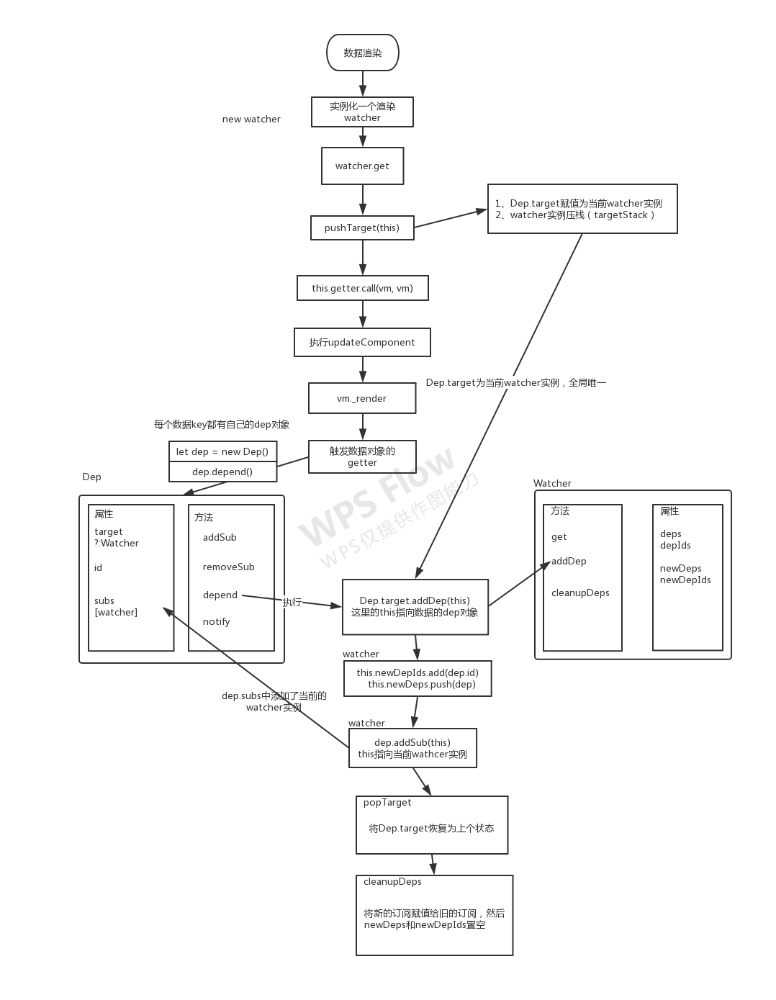
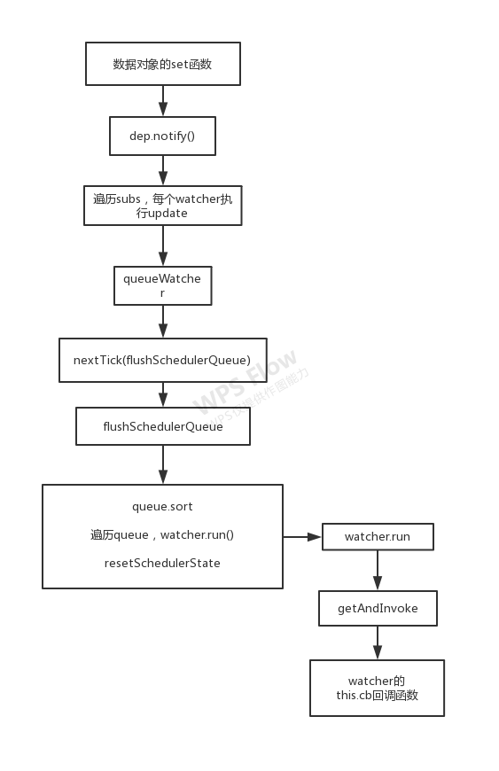

<!--
 * @Author: your name
 * @Date: 2020-02-22 11:57:35
 * @LastEditTime: 2020-02-22 18:00:16
 * @LastEditors: Please set LastEditors
 * @Description: In User Settings Edit
 * @FilePath: /Keep/源码解读/响应式原理/数据响应.md
 -->

# 深入响应式原理

## 定义响应式对象

`Object.defineProperty(obj, prop, descriptor)`

obj 对象名  
prop 对象的属性  
descriptor 对象属性的描述符(数据描述符和存取描述符，两者取其一，不能同时为两种)。

数据描述符示例：  

```javascript
var o = {}; // 创建一个新对象
// 在对象中添加一个属性与数据描述符的示例
Object.defineProperty(o, "a", {
  value : 37,
  writable : true,
  enumerable : true,
  configurable : true
});
// 对象o拥有了属性a，值为37
```

存取描述符示例:  

```javascript
// 在对象中添加一个属性与存取描述符的示例,这里不能定义value
var bValue;
Object.defineProperty(o, "b", {
  get : function(){
    return bValue;
  },
  set : function(newValue){
    bValue = newValue;
  },
  enumerable : true,
  configurable : true
});
o.b = 38;
// 对象o拥有了属性b，值为38
```

这里我们关心的是getter和setter函数对，当我们访问属性时，触发getter方法；当我们对属性做修改时，会触发setter方法。
vue利用Object.defineProperty方法，给data对象中的每个属性添加例getter和setter方法，使其变成了一个响应式对象。下面我们看一下源码中的具体实现。

```javascript
// @core/instance/state.js
// proxy做代理
const sharedPropertyDefinition = {
  enumerable: true,
  configurable: true,
  get: noop,
  set: noop
}
export function proxy (target: Object, sourceKey: string, key: string) {
  sharedPropertyDefinition.get = function proxyGetter () {
    return this[sourceKey][key]
  }
  sharedPropertyDefinition.set = function proxySetter (val) {
    this[sourceKey][key] = val
  }
  Object.defineProperty(target, key, sharedPropertyDefinition)
}
```

`proxy`方法在`initData`、`initProps`函数中被调用。看一下initData函数。

```javascript
function initData (vm: Component) {
  let data = vm.$options.data
  data = vm._data = typeof data === 'function'
    ? getData(data, vm)
    : data || {}
  if (!isPlainObject(data)) {
    data = {}
    // ...
  }
  // proxy data on instance
  const keys = Object.keys(data)
  const props = vm.$options.props
  const methods = vm.$options.methods
  let i = keys.length
  while (i--) {
    const key = keys[i]
    // ...
    if (props && hasOwn(props, key)) {
      //...
    } else if (!isReserved(key)) {
      proxy(vm, `_data`, key)
    }
  }
  // observe data
  observe(data, true /* asRootData */)
}
```

这里我们省略一些无关代码，看主流程，一是做了代理，通过proxy将vm._data.xxx都代理到vm.xxx上；二是observe了data对象，变成响应式对象，观察data的变化。看到这，其实我们还未寻找到源码中将data变成响应式对象的真正位置，我们接着看observe的实现。

```javascript
// @core/observer/index.js
/**
 * Attempt to create an observer instance for a value,
 * returns the new observer if successfully observed,
 * or the existing observer if the value already has one.
 */
export function observe (value: any, asRootData: ?boolean): Observer | void {
  if (!isObject(value) || value instanceof VNode) {
    return
  }
  let ob: Observer | void
  if (hasOwn(value, '__ob__') && value.__ob__ instanceof Observer) {
    ob = value.__ob__
  } else if (
    shouldObserve &&
    !isServerRendering() &&
    (Array.isArray(value) || isPlainObject(value)) &&
    Object.isExtensible(value) &&
    !value._isVue
  ) {
    ob = new Observer(value)
  }
  if (asRootData && ob) {
    ob.vmCount++
  }
  return ob
}
```

看得出来，这个函数返回了一个Observer类的实例对象，传入我们的data对象。需要满足data是非Vnode类型的对象，如果已经添加过则直接返回，否则在一定条件下去实例化一个Observer对象实例。
那么Observer类到底是个什么类呢？作用又是什么？接下去看一下Observer类的实现。

```javascript
// @core/observer/index.js
/**
 * Observer class that is attached to each observed
 * object. Once attached, the observer converts the target
 * object's property keys into getter/setters that
 * collect dependencies and dispatch updates.
 */
export class Observer {
  value: any;
  dep: Dep;
  vmCount: number; // number of vms that has this object as root $data

  constructor (value: any) {
    this.value = value
    this.dep = new Dep()
    this.vmCount = 0
    def(value, '__ob__', this)
    if (Array.isArray(value)) {
      const augment = hasProto
        ? protoAugment
        : copyAugment
      augment(value, arrayMethods, arrayKeys)
      this.observeArray(value)
    } else {
      this.walk(value)
    }
  }

  /**
   * Walk through each property and convert them into
   * getter/setters. This method should only be called when
   * value type is Object.
   */
  walk (obj: Object) {
    const keys = Object.keys(obj)
    for (let i = 0; i < keys.length; i++) {
      defineReactive(obj, keys[i])
    }
  }

  /**
   * Observe a list of Array items.
   */
  observeArray (items: Array<any>) {
    for (let i = 0, l = items.length; i < l; i++) {
      observe(items[i])
    }
  }
}
```

1、实例化Dep对象  
2、把Observer自身实例添加到数据对象value的`__ob__`属性上  
3、如果是数组，遍历并调用observe；如果是对象，遍历对象的key，调用`defineReactive(obj, keys[i])`

拨开云雾，我们来到了真正将数据对象变为响应式对象的函数中，即`defineReactive`.

```javascript
// @core/observer/index.js
export function defineReactive (
  obj: Object,
  key: string,
  val: any,
  customSetter?: ?Function,
  shallow?: boolean
) {
  // 实例化dep对象
  const dep = new Dep()

  const property = Object.getOwnPropertyDescriptor(obj, key)
  if (property && property.configurable === false) {
    return
  }

  // cater for pre-defined getter/setters
  const getter = property && property.get
  const setter = property && property.set
  if ((!getter || setter) && arguments.length === 2) {
    val = obj[key]
  }
  // 子对象递归调用observe
  let childOb = !shallow && observe(val)
  // 定义get set 做依赖收集和派发更新
  Object.defineProperty(obj, key, {
    enumerable: true,
    configurable: true,
    get: function reactiveGetter () {
      const value = getter ? getter.call(obj) : val
      if (Dep.target) {
        dep.depend()
        if (childOb) {
          childOb.dep.depend()
          if (Array.isArray(value)) {
            dependArray(value)
          }
        }
      }
      return value
    },
    set: function reactiveSetter (newVal) {
      const value = getter ? getter.call(obj) : val
      /* eslint-disable no-self-compare */
      if (newVal === value || (newVal !== newVal && value !== value)) {
        return
      }
      /* eslint-enable no-self-compare */
      if (process.env.NODE_ENV !== 'production' && customSetter) {
        customSetter()
      }
      if (setter) {
        setter.call(obj, newVal)
      } else {
        val = newVal
      }
      childOb = !shallow && observe(newVal)
      dep.notify()
    }
  })
}
```

defineReactive 函数
1、初始化`Dep`对象的实例，
2、拿到obj的属性描述符，然后对子对象递归调用`observe`方法。（这样就保证了无论obj的结构多复杂，它的所有子属性也能变成响应式的对象，这样我们访问或修改obj中一个嵌套较深的属性，也能触发getter和setter）.
3、最后利用`Object.defineProperty`去给 obj 的属性 key 添加 getter 和 setter。

我们看到getter和setter里面包含了依赖收集和派发更新。也就是在get函数中做依赖收集，在set函数中做派发更新。

看到这里有个疑问点，dep对象是干什么的呢？这里为什么要实例化Dep对象？在实例化Observer对象的时候，我们貌似也看到了那里也实例化了一个Dep对象并存储到Observer实例对象的dep属性里。

## 依赖收集

其实呢，Dep类是整个getter依赖收集的核心。
我们看一下get函数里的实现：

```javascript

// 实例化dep对象
const dep = new Dep()
...

get: function reactiveGetter () {
  const value = getter ? getter.call(obj) : val
  if (Dep.target) {
    dep.depend()
    if (childOb) {
      childOb.dep.depend()
      if (Array.isArray(value)) {
        dependArray(value)
      }
    }
  }
  return value
},
```

我们关注主流程，两行代码，一是`const dep = new Dep()`,实例化一个dep对象；二是`dep.depend()`做依赖收集。

要搞清楚Dep对象，我们看一下Dep类的定义：它的定义在 src/core/observer/dep.js 中，65行代码，很简单

### Dep

```javascript
import type Watcher from './watcher'
import { remove } from '../util/index'
import config from '../config'

let uid = 0

/**
 * A dep is an observable that can have multiple
 * directives subscribing to it.
 */
export default class Dep {
  // 属性包括 静态属性target、id、subs
  static target: ?Watcher;
  id: number;
  subs: Array<Watcher>;

  constructor () {
    this.id = uid++
    this.subs = []
  }

  addSub (sub: Watcher) {
    this.subs.push(sub)
  }

  removeSub (sub: Watcher) {
    remove(this.subs, sub)
  }

  depend () {
    if (Dep.target) {
      Dep.target.addDep(this)
    }
  }

  notify () {
    // stabilize the subscriber list first
    const subs = this.subs.slice()
    if (process.env.NODE_ENV !== 'production' && !config.async) {
      // subs aren't sorted in scheduler if not running async
      // we need to sort them now to make sure they fire in correct
      // order
      subs.sort((a, b) => a.id - b.id)
    }
    for (let i = 0, l = subs.length; i < l; i++) {
      subs[i].update()
    }
  }
}

// the current target watcher being evaluated.
// this is globally unique because there could be only one
// watcher being evaluated at any time.
Dep.target = null
const targetStack = []

export function pushTarget (_target: ?Watcher) {
  if (Dep.target) targetStack.push(Dep.target)
  Dep.target = _target
}

export function popTarget () {
  Dep.target = targetStack.pop()
}
```

静态属性target，这个是全局唯一的Watcher，这个设计巧妙，因为同一时间只能有一个全局的Watcher。（this is globally unique because there could be only one watcher being evaluated at any time.）

属性id，dep对象维护一个自身id

属性subs，dep对象维护一个Watcher数组

方法addSub， 将Watcher对象收集在subs数组中。

方法removeSub， 将某特定的watcher从subs数组中移除。

方法depend，调用Watcher的addDep方法，目的将当前watcher对象（Dep.target）添加到subs数组中。（这里有必要去看一下Watcher类的实现）

看到这里其实我们可以了解到Dep是干什么的，其实它相当于一个watcher的管理器，和watcher是相辅相成。

### Watcher

```javascript
// @core/observer/watcher.js
let uid = 0
export default class Watcher {
  vm: Component;
  expression: string;
  cb: Function;
  id: number;
  deep: boolean;
  user: boolean;
  computed: boolean;
  sync: boolean;
  dirty: boolean;
  active: boolean;
  dep: Dep;
  deps: Array<Dep>;
  newDeps: Array<Dep>;
  depIds: SimpleSet;
  newDepIds: SimpleSet;
  before: ?Function;
  getter: Function;
  value: any;

  constructor (
    vm: Component,
    expOrFn: string | Function,
    cb: Function,
    options?: ?Object,
    isRenderWatcher?: boolean
  ) {
    this.vm = vm
    if (isRenderWatcher) {
      // 当前vm实例的_watcher中存储自身（渲染watcher实例）
      vm._watcher = this
    }
    // console.log('渲染watcher实例：', vm._watcher)
    vm._watchers.push(this)
    // options
    if (options) {
      this.deep = !!options.deep
      this.user = !!options.user
      this.computed = !!options.computed
      this.sync = !!options.sync
      this.before = options.before
    } else {
      this.deep = this.user = this.computed = this.sync = false
    }
    this.cb = cb
    this.id = ++uid // uid for batching
    this.active = true
    this.dirty = this.computed // for computed watchers
    this.deps = []
    this.newDeps = []
    this.depIds = new Set()
    this.newDepIds = new Set()

    // 开发环境下，expression中存储函数表达式字符串
    this.expression = process.env.NODE_ENV !== 'production'
      ? expOrFn.toString()
      : ''
    // parse expression for getter
    if (typeof expOrFn === 'function') {
      this.getter = expOrFn
    } else {
      this.getter = parsePath(expOrFn)
      if (!this.getter) {
        this.getter = function () {}
      }
    }
    if (this.computed) {
      this.value = undefined
      this.dep = new Dep()
    } else {
      this.value = this.get()
    }
  }

  /**
   * Evaluate the getter, and re-collect dependencies.
   */
  get () {
    // debugger
    pushTarget(this)
    let value
    const vm = this.vm
    try {
      // 执行了传入的expOrFn函数
      // console.log('watcher this.getter函数 ===>', this.getter)
      value = this.getter.call(vm, vm)
    } catch (e) {
      if (this.user) {
        handleError(e, vm, `getter for watcher "${this.expression}"`)
      } else {
        throw e
      }
    } finally {
      // "touch" every property so they are all tracked as
      // dependencies for deep watching
      if (this.deep) {
        traverse(value)
      }
      popTarget()
      this.cleanupDeps()
    }
    return value
  }

  /**
   * Add a dependency to this directive.
   */
  addDep (dep: Dep) {
    const id = dep.id
    if (!this.newDepIds.has(id)) {
      this.newDepIds.add(id)
      this.newDeps.push(dep)
      if (!this.depIds.has(id)) {
        dep.addSub(this)
      }
    }
  }

  /**
   * Clean up for dependency collection.
   */
  cleanupDeps () {
    let i = this.deps.length
    while (i--) {
      const dep = this.deps[i]
      if (!this.newDepIds.has(dep.id)) {
        dep.removeSub(this)
      }
    }
    let tmp = this.depIds
    this.depIds = this.newDepIds
    this.newDepIds = tmp
    this.newDepIds.clear()
    tmp = this.deps
    this.deps = this.newDeps
    this.newDeps = tmp
    this.newDeps.length = 0
  }
  ...
}
```

看一下Watcher类中维护了一些dep相关的属性

```javscript
this.deps = []
this.newDeps = []
this.depIds = new Set()
this.newDepIds = new Set()
```

this.deps 和 this.newDeps 表示 Watcher 实例持有的 Dep 实例的数组；而 this.depIds 和 this.newDepIds 分别代表 this.deps 和 this.newDeps 的 id。
这里有个疑问，为什么要维护两个数组呢？维护它们的作用是什么？

```javascript
addDep (dep: Dep) {
  const id = dep.id
  if (!this.newDepIds.has(id)) {
    this.newDepIds.add(id)
    this.newDeps.push(dep)
    if (!this.depIds.has(id)) {
      dep.addSub(this)
    }
  }
}
```

看下addDep，作用就是将我当前的watcher实例给push到dep对象的subs数组里面。

代码看完了，我们对依赖收集的过程做一个梳理，从我们访问数据开始，也就是执行get开始，那么我们在什么时机会去访问数据呢？其实就是我们数据渲染的时候，还记得我们首次渲染dom，会执行到new Watcher实例化一个渲染watcher，在实例化watcher的时候进入构造函数逻辑，会执行watcher对象的get()方法。所以我们再来看一下watcher中的get方法。

```javascript
get () {
  // debugger
  pushTarget(this)
  let value
  const vm = this.vm
  try {
    // 执行了传入的expOrFn函数
    // console.log('watcher this.getter函数 ===>', this.getter)
    value = this.getter.call(vm, vm)
  } catch (e) {
    if (this.user) {
      handleError(e, vm, `getter for watcher "${this.expression}"`)
    } else {
      throw e
    }
  } finally {
    // "touch" every property so they are all tracked as
    // dependencies for deep watching
    if (this.deep) {
      traverse(value)
    }
    popTarget()
    this.cleanupDeps()
  }
  return value
}
```

pushTarget方法时定义都在dep.js中的  

```javascript
export function pushTarget (_target: Watcher) {
  if (Dep.target) targetStack.push(Dep.target)
  Dep.target = _target
}
```

`pushTarget(this)` 将当前的watcher实例压入栈中（targetStack）

`Dep.target`变成当前这个watcher实例

接着执行语句

```javascript
value = this.getter.call(vm, vm)
```

也就是执行updateComponent方法，然后就会执行vm._render(), 这个函数执行后会生成渲染VNode，并且在这个过程中会对vm上的数据访问，这个时候就触发了数据对象的getter。

每个数据对象值的getter都有自己的dep实例对象。（前面提到）

触发getter，就会实例化dep，并执行dep.depend()，也就执行里面的Dep.target.addDep(this)。

刚才我们提到，Dep.target已经被赋值为当前渲染watcher实例了，那么就会执行到这个实例对象的addDep方法。addDep中首先做一些逻辑判定（防止同一数据被多次添加），然后执行dep.addSub(this),这里的this是当前渲染watcher实例，所以最终把当前watcher实例订阅到这个数据持有的dep（即数据的get函数中定义的dep实例）的subs中。为后续数据变化时候能通知到哪些subs做准备（为派发更新做准备咯）。

在vm._render()过程中，会触发所有数据的getter，这样实际上已经完成了一个依赖收集的过程。但是完成依赖收集后，还有几个逻辑要执行：我们看到watcher的get方法中的finally中的代码

```javascript
try {
  // 执行了传入的expOrFn函数(updateComponent)
  value = this.getter.call(vm, vm)
} catch (e) {
  // ...
} finally {
  // "touch" every property so they are all tracked as
  // dependencies for deep watching
  if (this.deep) {
    traverse(value)
  }
  popTarget()
  this.cleanupDeps()
}
```

```javascript
if (this.deep) {
  traverse(value)
}
```

这个是要递归去访问 value，触发它所有子项的getter

```javascript
popTarget()
// popTarget中的实现是：
Dep.target = targetStack.pop()
```

当前watcher实例出栈，也就是把Dep.target恢复到上一个状态。因为当前vm的数据依赖收集已经完成，那么对应的渲染Dep.target也需要改变。

```javascript
this.cleanupDeps()
// cleanupDeps的实现：
cleanupDeps () {
  let i = this.deps.length
  while (i--) {
    const dep = this.deps[i]
    if (!this.newDepIds.has(dep.id)) {
      dep.removeSub(this)
    }
  }
  let tmp = this.depIds
  this.depIds = this.newDepIds
  this.newDepIds = tmp
  this.newDepIds.clear()
  tmp = this.deps
  this.deps = this.newDeps
  this.newDeps = tmp
  this.newDeps.length = 0
}
```

### cleanupDeps是新订阅换旧订阅

vue是数据驱动所以每次数据变化都会重新执行vm._render, 上面提及在render过程中会触发数据的getter，所以Wathcer在构造函数中会初始化两个Dep实例数组，newDeps表示新添加的Dep实例数组，而deps表示上一次添加的Dep实例数组。

在执行cleanupDeps函数的时候，会首先遍历deps，如果newDep中没有旧的dep，移除dep.subs数组中Wathcer实例，也就是取消订阅，然后把newDepIds和 depIds交换，newDeps和deps交换，并把newDepIds和newDeps清空。
是一个新依赖换旧依赖的过程。

### 依赖收集部分 总结一下

收集依赖的目的是为了当这些响应式数据发生变化，触发它们的setter的时候，能知道应该通知哪些订阅者去做相应的逻辑处理。因为每个数据对象值都有自己的dep对象，这个dep对象里收集了依赖，也就是做了订阅，当触发数据对象的getter时，我们就通知这些“依赖”去做某些事情（如对某个节点重新渲染啦）。



Watcher和Dep就是一个非常经典的观察者设计模式的实现。。。。


## 派发更新

setter函数

```javascript
set: function reactiveSetter (newVal) {
    const value = getter ? getter.call(obj) : val
    /* eslint-disable no-self-compare */
    if (newVal === value || (newVal !== newVal && value !== value)) {
      return
    }
    ...
    if (setter) {
      setter.call(obj, newVal)
    } else {
      val = newVal
    }
    childOb = !shallow && observe(newVal)
    dep.notify()
  }
```

关键代码：  
`childOb = !shallow && observe(newVal)`  
如果shallow为false的情况，会对新设置的值变成一个响应式对象；

`dep.notify()`  
通知所有的订阅者，派发更新

下面看一下Dep类中定义的notify方法

```javascript
class Dep {
  ...
  notify () {
    // stabilize the subscriber list first
    const subs = this.subs.slice()
    // ...省略
    for (let i = 0, l = subs.length; i < l; i++) {
      subs[i].update()
    }
  }
}
```

遍历subs里面存的watcher实例，并执行每个watcher的update方法。

那我们看下watcher类中定义的update方法

```javascript
// @core/observer/watcher.js
/**
  * Subscriber interface.
  * Will be called when a dependency changes.
  */
update () {
  /* istanbul ignore else */
  if (this.computed) {
    // A computed property watcher has two modes: lazy and activated.
    // It initializes as lazy by default, and only becomes activated when
    // it is depended on by at least one subscriber, which is typically
    // another computed property or a component's render function.
    if (this.dep.subs.length === 0) {
      // In lazy mode, we don't want to perform computations until necessary,
      // so we simply mark the watcher as dirty. The actual computation is
      // performed just-in-time in this.evaluate() when the computed property
      // is accessed.
      this.dirty = true
    } else {
      // In activated mode, we want to proactively perform the computation
      // but only notify our subscribers when the value has indeed changed.
      this.getAndInvoke(() => {
        this.dep.notify()
      })
    }
  } else if (this.sync) {
    this.run()
  } else {
    queueWatcher(this)
  }
}
```

主流程走到`queueWatcher(this)`

```javascript
// @core/observer/scheduler.js
const queue: Array<Watcher> = []
let has: { [key: number]: ?true } = {}
let waiting = false
let flushing = false

export function queueWatcher (watcher: Watcher) {
  const id = watcher.id
  // 用has对象保证同一个Watcher只添加一次
  if (has[id] == null) {
    has[id] = true
    if (!flushing) {
      queue.push(watcher)
    } else {
      // if already flushing, splice the watcher based on its id
      // if already past its id, it will be run next immediately.
      let i = queue.length - 1
      while (i > index && queue[i].id > watcher.id) {
        i--
      }
      queue.splice(i + 1, 0, watcher)
    }
    // queue the flush
    if (!waiting) {
      // waiting保证nextTick(flushSchedulerQueue)的调用逻辑只执行一次
      waiting = true
      // ...
      // 下个tick执行，异步的去执行 flushSchedulerQueue
      nextTick(flushSchedulerQueue)
    }
  }
}

```

Vue在做派发更新的时候的一个优化的点，它并不会每次数据改变都触发watcher的回调，而是把这些watcher先添加到一个队列里，然后在nextTick后执行 flushSchedulerQueue。

执行flushSchedulerQueue。

```javascript
function flushSchedulerQueue () {
  flushing = true
  let watcher, id

  // Sort queue before flush.
  // This ensures that:
  // 1. Components are updated from parent to child. (because parent is always
  //    created before the child)
  // 2. A component's user watchers are run before its render watcher (because
  //    user watchers are created before the render watcher)
  // 3. If a component is destroyed during a parent component's watcher run,
  //    its watchers can be skipped.
  queue.sort((a, b) => a.id - b.id)

  // do not cache length because more watchers might be pushed
  // as we run existing watchers
  for (index = 0; index < queue.length; index++) {
    watcher = queue[index]
    if (watcher.before) {
      watcher.before()
    }
    id = watcher.id
    has[id] = null
    watcher.run()
    // ...
  }
  // keep copies of post queues before resetting state
  const activatedQueue = activatedChildren.slice()
  const updatedQueue = queue.slice()

  resetSchedulerState()
  // ...
}
```

flushSchedulerQueue:  
1、对队列进行排序，以id从小到大排序  
2、遍历队列，执行watcher.run()，在 watcher.run() 的时候，很可能用户会再次添加新的watcher，这样会再次执行到queueWatcher，所以遍历时每次queue的长度都要重新计算。  
3、resetSchedulerState状态恢复，将控制流程状态的一些变量恢复到初始值，把watcher队列清空。

接着看run()的逻辑：

```javascript
/**
  * Scheduler job interface.
  * Will be called by the scheduler.
  */
run () {
  if (this.active) {
    this.getAndInvoke(this.cb)
  }
}

getAndInvoke (cb: Function) {
  const value = this.get()
  if (
    value !== this.value ||
    // Deep watchers and watchers on Object/Arrays should fire even
    // when the value is the same, because the value may
    // have mutated.
    isObject(value) ||
    this.deep
  ) {
    // set new value
    const oldValue = this.value
    this.value = value
    this.dirty = false
    if (this.user) {
      try {
        cb.call(this.vm, value, oldValue)
      } catch (e) {
        // ...
      }
    } else {
      cb.call(this.vm, value, oldValue)
    }
  }
}
```

run实际上执行了下面的getAndInvoke(this.cb)，传入watcher回调函数。
getAndInvoke函数
1、先通过this.get()得到当前的值
2、做判断，如果满足新旧值不等、新值是对象类型、deep模式任何一个条件，则执行 watcher 的回调。
3、回调函数执行的时候把第一个和第二个参数传入新值value和旧值oldValue，这也是当我们添加自定义 watcher的时候能在回调函数的参数中拿到新旧值的原因。

简言之，watcher.run就是会在满足一定条件时执行watcher的回调函数cb。

相比之下，派发更新的主逻辑流程还是比较简单的。当我们数据变化触发setter时，会执行dep.notify，遍历dep.subs中的watcher实例并执行实例的update方法。update方法中，会queueWatcher将watcher排到队列queue中(利用了队列做了进一步优化)，然后在下一个tick中执行flushSchedulerQueue方法，也就是遍历队列，依次执行watcher的run方法，也就是执行getAndInvoke方法，最后在满足条件的情况下执行watcher的回调函数cb。至此就是一个派发更新的过程。

