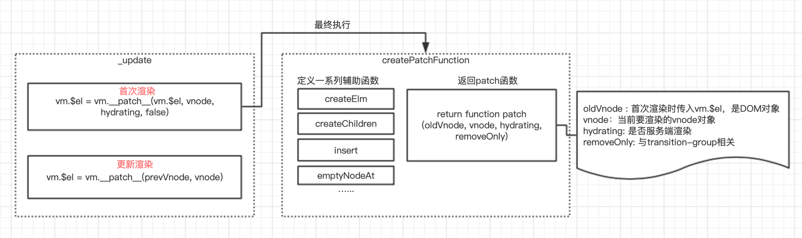
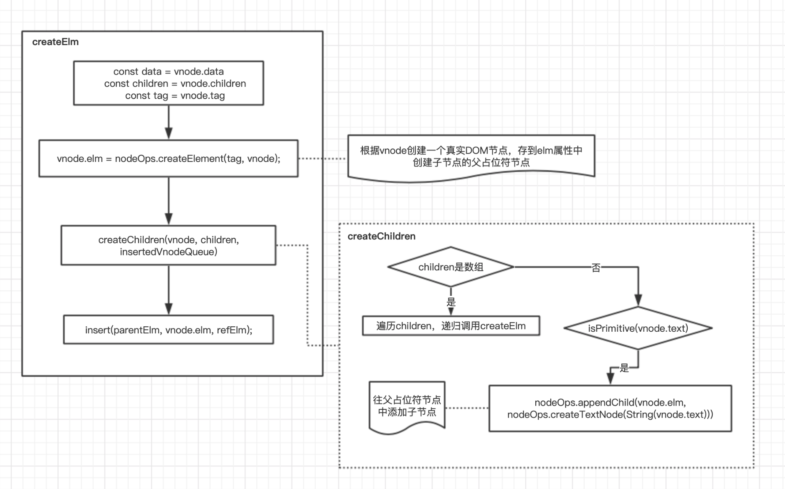

# Vuejs 数据首次渲染的过程

## new Vue

### init函数

_init函数中做了以下几件事：

1. 合并配置。判断是否是组件init，如果不是组件，则执行mergeOptions方法，mergeOptions方法会对不同的属性采用不同的合并策略，最终合并为一个对象并返回。如果是组件则执行initInternalComponent方法，该方法做了简单一层对象赋值：第一步，创建一个以子组件构造器的options为原型对象的空对象，赋值给vm.$options；第二步，将父vue实例和父VNode实例分别存入当前的vm.$options的parent属性和_parentVnode属性中。

2. 初始化生命周期相关变量，初始化事件中心，初始化渲染相关，初始化 data、props、watch、computed、methods等一系列初始化操作。

3. 检测是否有el属性，如果有，则调用vm.$mount方法挂载vm，实现vue实例的挂载，将模版渲染为最终的DOM。

```javascript
export function initMixin(Vue) {
    Vue.prototype._init = function(options) {
        const vm = this
        // ...省略代码
        vm._isVue = true
        // 合并配置
        if (options && options._isComponent) {
            // 如果是组件，将父vue实例和父VNode实例存入当前的vm.$options中。
            initInternalComponent(vm, options)
        } else {
            // mergeOptions方法会根据不同的属性采用不同的合并策略进行合并
            vm.$options = mergeOptions(
                resolveConstructorOptions(vm.constructor),
                options || {},
                vm
            )
        }
        // ...省略代码
        vm._self = vm
        // 一系列的初始化操作
        initLifecycle(vm) // 初始化与生命周期相关的变量
        initEvents(vm) // 初始化事件中心
        initRender(vm) // 初始化渲染:初始化节点属性信息，绑定createElement函数到实例
        callHook(vm, 'beforeCreate') // 调用beforeCreate钩子回调函数
        initInjections(vm) // 初始化注入
        initState(vm) // 初始化 data、props、watch、computed、methods
        initProvide(vm)
        callHook(vm, 'created') // 调用created钩子回调函数
        // ...省略代码
        // $mount 挂载
        if (vm.$options.el) {
            vm.$mount(vm.$options.el)
        }
    }
}
```

### mount函数

上一节中我们看到init最后一步通过调用vm.$mount方法挂载vm，下面我们找到带编译版本的$mount方法，在platforms/web/entry-runtime-with-compiler.js中的Vue.prototype.$mount方法。

```javascript
/* --- platforms/web/runtime/index.js --- */
// 公共的 mount 方法 (定义在runtime/index.js中)
Vue.prototype.$mount = function (
  el?: string | Element,
  hydrating?: boolean
): Component {
  el = el && inBrowser ? query(el) : undefined
  return mountComponent(this, el, hydrating)
}

/* --- platforms/web/entry-runtime-with-compiler.js --- */
// 通过id匹配元素，返回元素的innerHTML
const idToTemplate = cached(id => {
  const el = query(id)
  return el && el.innerHTML
})
// 缓存在runtime/index.js中定义的Vue原型上的$mount方法
const mount = Vue.prototype.$mount
// 重新定义一遍$mount方法，runtimeOnly版本的没有这部分逻辑
Vue.prototype.$mount = function (
  el?: string | Element,
  hydrating?: boolean
): Component {
  // el参数处理，最终是一个DOM对象
  el = el && query(el)

  // 如果el是body或是文档标签（html），则报警告
  if (el === document.body || el === document.documentElement) {
    process.env.NODE_ENV !== 'production' && warn(
      `Do not mount Vue to <html> or <body> - mount to normal elements instead.`
    )
    return this
  }

  const options = this.$options
  // 判断有没有定义render方法
  if (!options.render) {
    let template = options.template
    // 判断有没有写template
    if (template) {
      if (typeof template === 'string') {
        // 如果template以 # 开始，则它将被用作选择符，找到匹配元素的 innerHTML 作为模板
        if (template.charAt(0) === '#') {
          template = idToTemplate(template)
          // 如果找不到匹配元素则报警告
          if (process.env.NODE_ENV !== 'production' && !template) {
            warn(
              `Template element not found or is empty: ${options.template}`,
              this
            )
          }
        }
      } else if (template.nodeType) {
        // 如果template是个DOM对象，则拿到innerHTML
        template = template.innerHTML
      } else {
        // 如果template既不是字符串也不是DOM对象，则报警告
        if (process.env.NODE_ENV !== 'production') {
          warn('invalid template option:' + template, this)
        }
        return this
      }
    } else if (el) {
      // 如果没有template，但是有el，则拿到el这个DOM对象的OuterHTML，赋值给template
      template = getOuterHTML(el)
    }
    // *最终得到的template是一个DOM字符串
    // 编译相关代码
    if (template) {
      // ...省略性能埋点的代码
      // 编译生成render函数，并挂到options上
      const { render, staticRenderFns } = compileToFunctions(template, {
        shouldDecodeNewlines,
        shouldDecodeNewlinesForHref,
        delimiters: options.delimiters,
        comments: options.comments
      }, this)
      // 这个render函数会在之后渲染VNode时用到
      options.render = render
      // 静态render函数
      options.staticRenderFns = staticRenderFns
    }
  }
  return mount.call(this, el, hydrating)
}
```

runtime+compiler版本：首先，缓存Vue原型上的$mount方法；第二步，el参数处理，如果el是字符串，则调用query方法将其转换为DOM对象；第三步判断有没有render函数，如果没有，通过compileToFunctions将template字符串转换为render函数，存到options.render中；最后，调用之前缓存的Vue原型上的$mount方法。
runtime only版本：会直接执行Vue原型上的$mount，第一步是处理el参数，将其转换为DOM对象，第二步调用mountComponent方法。

我们看到mount函数中调用了mountComponent方法，接着看一下mountComponent函数的实现：

```javascript
export function mountComponent(vm, el, hydrating) {
    // 将el这个DOM对象缓存到$el属性中
    vm.$el = el;
    if (!vm.$options.render) {
        // 如果没有写render函数或者template没有正确地转化为render函数，则定义创建一个空VNode
        vm.$options.render = createEmptyVNode
        // ...省略一些警告的代码
    }
    // 调beforeMount钩子函数
    callHook(vm, 'beforeMount')
    // 定义updateComponent
    let updateComponent
    if (process.env.NODE_ENV !== 'production' && config.performance && mark) {
        // ...省略性能埋点相关代码
    } else {
        // 执行一次渲染
        updateComponent = () => {
            // 这里执行vm._render()会返回一个VNode
            // hydrating是服务端渲染相关参数， false表示非服务端渲染
            vm._update(vm._render(), hydrating)
            // 最后，执行_update会执行patch方法将VNode渲染到真实DOM
        }
    }

    // 实例化渲染watcher
    // 会执行watcher内部的this.getter.call(vm, vm) 从而执行updateComponent方法
    // 这里watcher作用：1、初始化的时候会执行回调函数（updateComponent)
    // 2、当 vm 实例中的监测的数据发生变化的时候执行回调函数（updateComponent)
    new Watcher(vm, updateComponent, noop, {
        before() {
            if (vm._isMounted) {
                callHook(vm, 'beforeUpdate')
            }
        }
    }, true /* isRenderWatcher */)
    hydrating = false
    if (vm.$vnode == null) {
        vm._isMounted = true
        callHook(vm, 'mounted')
    }
    return vm
}
```

执行mountComponent方法，主要有以下几步：

1. vm.$el = el;将el缓存到vm.$el属性中。

2. 判断是否有render函数（vm.$options.render），如果没有，报警告。

3. 执行beforeMount钩子函数，callHook(vm, 'beforeMount')。

4. 定义updateComponent函数 updateComponent = () => { vm._update(vm._render(), hydrating) }

5. 实例化渲染watcher，实例化过程中会执行updateComponent方法，达到数据最终渲染为DOM的目的。

在实例化watcher时，会调用updateComponent方法执行一次渲染，也就是我们本章主题：DOM的首次渲染。

本章最关键的剧情：updateComponent，接下来，先后出场两位演员，1）render函数 2）update函数

### render函数

_render方法，最终返回一个VNode对象，是在renderMixin中被定义的，也是一个在Vue.prototype上的方法。renderMixin会在new Vue实例化时被调用。
在_render方法里，最关键的步骤是调用options中的render函数，最终返回一个虚拟Node（vnode）。
前面vue实例挂载中有提到options中的render函数，要么是开发者手写的，要么就是通过compileToFunctions方法编译生成的，总之一定要有render函数的。

```javascript
Vue.prototype._render = function () {
  const vm = this
  const { render, _parentVnode } = vm.$options
  // ...省略代码
  let vnode
  try {
    // vm._renderProxy在生产环境是vm（在_init方法中定义了）
    // 开发环境在initProxy中定义， 作用是报警告
    // 比如在render过程中使用了没有在data中定义的属性，会报警告
    vnode = render.call(vm._renderProxy, vm.$createElement)
  } catch (e) {
    // ...省略代码
  }
  // ...省略代码
  // 返回一个VNode对象
  return vnode
}
```

vnode = render.call(vm._renderProxy, vm.$createElement)，执行用户手写的render或编译生成的render函数。
简单的自定义render函数：

```javascript
// 用户手写render
new Vue({
  el: '#app',
  data() {
    return {
      message: 'Hello vue!'
    }
  },
  render(createELement) {
    return createELement('div', {
      attrs: {
        id: 'app1'
      }
    }, this.message)
  }
})
```

如上，自定义了render函数，可以看出，render函数中createElement方法就是vm.$createElement方法。
vm.$createElement方法是在initRender方法中定义的，initRender方法在初始化Vue的时候会被调用。

```javascript
export function initRender(vm) {
    // ...省略代码
    // 被程序编译生成的render函数使用
    vm._c = (a, b, c, d) => createElement(vm, a, b, c, d, false);
    // 用户自定义的render函数使用
    vm.$createElement = (a, b, c, d) => createElement(vm, a, b, c, d, true);
}
```

```javascript
import {
  normalizeChildren,
  simpleNormalizeChildren
} from './helpers/index'

const SIMPLE_NORMALIZE = 1
const ALWAYS_NORMALIZE = 2
// 对_createElement方法的封装，允许传入的参数更加灵活；
// 在处理这些参数后，调用真正创建VNODE的函数_createElement
export function createElement(
context,
tag,
data,
children,
normalizationType,
alwaysNormalize) {
    // 检测参数，对参数个数不一致进行处理
    // 如果传入第三个参数是数组，数组应该是children处的参数，所以将data赋值给children
    if (Array.isArray(data) || isPrimitive(data)) {
        normalizationType = children;
        children = data;
        data = undefined
    }
    if (isTrue(alwaysNormalize)) {
        normalizationType = ALWAYS_NORMALIZE
    }
    return _createElement(context, tag, data, children, normalizationType)
}

export function _createElement(
context, // 表示VNode的上下文环境
tag, // 表示标签
data, // 表示VNode的数据对象，VNodeData
children, // 表示当前VNode的子节点，它是任意类型的，需要被规范为标准的VNode数组。
normalizationType //表示子节点规范的类型，类型不同，调用的规范的方法也就不一样。
) {
  // data:VNodeData不能是响应式的
  if (isDef(data) && isDef((data: any).__ob__)) {
    process.env.NODE_ENV !== 'production' && warn(
      `Avoid using observed data object as vnode data: ${JSON.stringify(data)}\n` +
      'Always create fresh vnode data objects in each render!',
      context
    )
    return createEmptyVNode() // 注释节点 空VNode
  }
  // object syntax in v-bind
  if (isDef(data) && isDef(data.is)) {
    tag = data.is
  }
  if (!tag) {
    // in case of component :is set to falsy value
    return createEmptyVNode()
  }
  // data.key只能是基础类型
  // warn against non-primitive key
  if (process.env.NODE_ENV !== 'production' &&
    isDef(data) && isDef(data.key) && !isPrimitive(data.key)
  ) {
    if (!__WEEX__ || !('@binding' in data.key)) {
      warn(
        'Avoid using non-primitive value as key, ' +
        'use string/number value instead.',
        context
      )
    }
  }
  // support single function children as default scoped slot
  if (Array.isArray(children) &&
    typeof children[0] === 'function'
  ) {
    data = data || {}
    data.scopedSlots = { default: children[0] }
    children.length = 0
  }
  // children的规范化，规范为VNode的数组
  if (normalizationType === ALWAYS_NORMALIZE) {
    children = normalizeChildren(children)
  } else if (normalizationType === SIMPLE_NORMALIZE) {
    // 程序编译生成的情况
    children = simpleNormalizeChildren(children)
  }
  // 创建VNode
  let vnode, ns
  if (typeof tag === 'string') {
    // tag为字符串
    let Ctor
    ns = (context.$vnode && context.$vnode.ns) || config.getTagNamespace(tag)
    if (config.isReservedTag(tag)) {
      // tag是html保留标签
      vnode = new VNode(
        config.parsePlatformTagName(tag), data, children,
        undefined, undefined, context
      )
    } else if (isDef(Ctor = resolveAsset(context.$options, 'components', tag))) {
      // component
      vnode = createComponent(Ctor, data, context, children, tag)
    } else {
      // unknown or unlisted namespaced elements
      // check at runtime because it may get assigned a namespace when its
      // parent normalizes children
      vnode = new VNode(
        tag, data, children,
        undefined, undefined, context
      )
    }
  } else {
    // tag是组件
    // direct component options / constructor
    vnode = createComponent(tag, data, context, children)
  }
  // 返回vnode
  if (Array.isArray(vnode)) {
    return vnode
  } else if (isDef(vnode)) {
    if (isDef(ns)) applyNS(vnode, ns)
    if (isDef(data)) registerDeepBindings(data)
    return vnode
  } else {
    return createEmptyVNode()
  }
}
```

createElement方法在vdom/create-element.js中定义，重点流程：

1. 将children变成一个VNode的数组。_createElement接收的第4个参数children是任意类型的，我们需要将其规范化为VNode类型数组。根据normalizationType的不同，调用normalizeChildren(children)和simpleNormalizeChildren(children)。
2. VNode的创建，返回vnode。

我们看到了render函数的执行最终返回了一个VNode对象。这个VNode对象作为vm._update方法的第一个参数传入，接着我们看一下_update方法的实现

在第一步中有两个children规范化函数需要提一下：simpleNormalizeChildren和normalizeChildren。这两个函数的目的是将传入的children，转化为vnode类型的数组。调用场景区分：

1. simpleNormalizeChildren的调用场景：render函数是程序编译生成的。理论上编译生成的children都已经是VNode类型的，但是有一个例外，就是函数式组件返回的是一个数组，而不是一个根节点，所以可以通过Array.prototype.concat方法将children数组打平，让其深度只有一层。
2. normalizeChildren方法的调用场景：1、render函数是用户手写的；2、当编译slot、v-for的时候会产生嵌套数组的情况，会调用normalizeArrayChildren。

```javascript
// 当children中含有函数式组件的情况：函数式组件会返回一个数组而不是一个根VNode。
// 这种情况下，就需要将嵌套数组拍平。
// 我们只需要一层的遍历，因为函数式组件已经保证它的children是VNode数组。
export function simpleNormalizeChildren (children: any) {
  for (let i = 0; i < children.length; i++) {
    if (Array.isArray(children[i])) {
      return Array.prototype.concat.apply([], children)
    }
  }
  return children
}
// 通常children可以是任意类型的，render函数是用户手写时，children可能是基础类型或包含基础类型
// 程序编译slot、v-for的时候会产生children是嵌套数组的情况
export function normalizeChildren (children: any): ?Array<VNode> {
  // 如果children是基础类型，那么调用createTextVNode创建一个文本VNode，返回一个包含这个VNode的数组
  // 如果children是数组类型，那么调用normalizeArrayChildren，返回一个VNode数组
  // 否则返回undefined
  return isPrimitive(children)
    ? [createTextVNode(children)]
    : Array.isArray(children)
      ? normalizeArrayChildren(children)
      : undefined
}

// 判断是否为文本节点
function isTextNode (node): boolean {
  return isDef(node) && isDef(node.text) && isFalse(node.isComment)
}

// 格式化children，返回VNode数组
function normalizeArrayChildren (children: any, nestedIndex?: string) {
  const res = []
  let i, c, lastIndex, last
  // 遍历children
  for (i = 0; i < children.length; i++) {
    // 单个child
    c = children[i]
    if (isUndef(c) || typeof c === 'boolean') continue
    lastIndex = res.length - 1
    last = res[lastIndex]
    if (Array.isArray(c)) {
      // children是嵌套数组的情况， 即如果单个child是个数组则递归调用normalizeArrayChildren
      if (c.length > 0) {
        c = normalizeArrayChildren(c, `${nestedIndex || ''}_${i}`)
        // 最后一个处理的节点和下次第一个处理的节点如果两个都是文本节点，合并两个节点
        if (isTextNode(c[0]) && isTextNode(last)) {
          res[lastIndex] = createTextVNode(last.text + (c[0]: any).text)
          c.shift()
        }
        res.push.apply(res, c)
      }
    } else if (isPrimitive(c)) {
      // 单个child是基础类型
      if (isTextNode(last)) {
        // merge adjacent text nodes
        // this is necessary for SSR hydration because text nodes are
        // essentially merged when rendered to HTML strings
        res[lastIndex] = createTextVNode(last.text + c)
      } else if (c !== '') {
        // 将基础类型值转为vnode
        res.push(createTextVNode(c))
      }
    } else {
      if (isTextNode(c) && isTextNode(last)) {
        // 当前是个文本节点且上一个也是文本节点，合并两个节点
        // merge adjacent text nodes
        res[lastIndex] = createTextVNode(last.text + c.text)
      } else {
        // 针对v-for的情况且没有写key，给他默认添加key
        // default key for nested array children (likely generated by v-for)
        if (isTrue(children._isVList) &&
          isDef(c.tag) &&
          isUndef(c.key) &&
          isDef(nestedIndex)) {
          c.key = `__vlist${nestedIndex}_${i}__`
        }
        // 除了基础类型和数组类型的情况，其他情况c都是VNode，直接push
        res.push(c)
      }
    }
  }
  return res
}
```

### update函数

_update方法定义在lifecycle.js中的lifecycleMixin，lifecycle会在instance/index.js中执行，也就是vue初始化时原型上就有_update方法了。
_update方法有两种场景下会被调用：

1. 首次渲染，mount的时候

2. 数据改变更新视图的时候

本章中讲解首次渲染mount时。

```javascript
Vue.prototype._update = function(vnode, hydrating) {
    const vm = this
    // 数据更新所需变量
    const prevEl = vm.$el
    const prevVnode = vm._vnode
    const preActiveInstance = activeInstance
    activeInstance = vm
    // 缓存当前vnode
    vm._vnode = vnode
    if (!prevVnode) {
        // 首次渲染
        vm.$el = vm.__patch__(vm.$el, vnode, hydrating, false)
    } else {
        vm.$el = vm.__patch__(prevVnode, vnode)
    }
    activeInstance = prevActiveInstance
    // ...
}
```

其中将vnode渲染为dom的关键步骤是vm.__patch__

Vue.prototype.__patch__ 方法在不同的平台有不同的定义，在web平台中它的定义在platforms/web/runtime/index.js中，在weex中它的定义在platforms/weex/runtime/index.js。

```javascript
// In web/runtime/index.js
import { patch } from './patch'
Vue.prototype.__patch__ = inBrowser ? patch : noop

// In ./patch.js
import * as nodeOps from 'web/runtime/node-ops' // 封装了一系列DOM操作的方法
import { createPatchFunction } from 'core/vdom/patch'
import baseModules from 'core/vdom/modules/index'
import platformModules from 'web/runtime/modules/index'

const modules = platformModules.concat(baseModules) // 定义了一些模块的钩子函数的实现
export const patch = createPatchFunctions({ nodeOps, modules })

// In core/vdom/patch.js
const hooks = ['create', 'activate', 'update', 'remove', 'destroy']
export function createPatchFunction(backend) {
    let i, j
    const cbs = {}
    const {nodeOps, modules} = backend
    // 初始化一些钩子函数
    for (i=0; i<hooks.length; ++i) {
        cbs[hooks[i]] = []
        for (j=0;j<modules.length; ++i) {
            if(isDef(modules[j][hook[i]])) {
                cbs[hooks[i]].push(modules[j][hooks[i]])
            }
        }
    }

    // ...

    // 一些内部辅助方法
    function emptyNodeAt(elm) {
        return new VNode(nodeOps.tagName(elm).toLowerCase(), {}, [], undefined, elm)
    }

    // ...

    function createElm(
        vnode,
        insertedVnodeQueue,
        parentElm,
        refElm,
        nested,
        ownerArray,
        index
    ) {
        // 通过虚拟节点创建真实的DOM并插入到它的父节点
        // ...
    }
    // ...
    function createChildren(vnode, children, insertVnodeQueue) {
        // 遍历子虚拟节点，递归调用createElm
        // ...
    }
    // ...
    return function patch(oldVnode, vnode, hydrating, removeOnly) {
        // ...
    }
}
```



执行vm.$el = vm.__patch__(vm.$el, vnode, hydrating, false) 也就最终执行了patch(oldVnode, vnode, hydrating, removeOnly)

首次渲染，在执行patch的时候，传入的vm.$el对应的是例子中id为app的DOM对象，这个也就是我们在index.html模版中写的`<div id="app">`，vm.$el的赋值是在之前的mountComponent函数做的。vnode对应的是调用render函数后的返回值。
patch函数接收4个参数

1. oldVnode 旧的VNode节点，它可以不存在或者是一个真实DOM对象。

2. vnode 表示执行_render后的vnode节点

3. hydrating 表示是否是服务端渲染

4. removeOnly是给transition-group用的

确定入参后，看patch函数的执行过程。

```javascript
return function patch (oldVnode, vnode, hydrating, removeOnly) {
    // ... 省略代码

    if (isUndef(oldVnode)) {
      // ...省略代码
    } else {
      // 判断oldVnode是不是真实的DOM
      const isRealElement = isDef(oldVnode.nodeType)
      if (!isRealElement && sameVnode(oldVnode, vnode)) {
        // patch existing root node
        patchVnode(oldVnode, vnode, insertedVnodeQueue, removeOnly)
      } else {
        if (isRealElement) {

          // ...省略代码（服务端渲染相关）

          // 将真实DOM转换成一个Vnode， oldVnode的elm属性上存着真实DOM
          oldVnode = emptyNodeAt(oldVnode)
        }

        // oldElm缓存真实DOM div#app
        const oldElm = oldVnode.elm 

        // 存储oldElm的父节点 本例是body
        const parentElm = nodeOps.parentNode(oldElm)

        // create new node
        // 通过虚拟节点创建真实的 DOM 并插入到它的父节点
        createElm(
          vnode,
          insertedVnodeQueue,
          // extremely rare edge case: do not insert if old element is in a
          // leaving transition. Only happens when combining transition +
          // keep-alive + HOCs. (#4590)
          oldElm._leaveCb ? null : parentElm,
          nodeOps.nextSibling(oldElm)
        )

        // ...省略代码 （递归更新父占位符节点元素）

        // 删除老的节点
        if (isDef(parentElm)) {
          removeVnodes(parentElm, [oldVnode], 0, 0)
        } else if (isDef(oldVnode.tag)) {
          invokeDestroyHook(oldVnode)
        }
      }
    }

    invokeInsertHook(vnode, insertedVnodeQueue, isInitialPatch)
    return vnode.elm
  }
```

#### createElm函数

作用是通过虚拟节点创建真实的DOM并插入到它的父节点中。

```javascript
function createElm(
        vnode,
        insertedVnodeQueue,
        parentElm,
        refElm,
        nested,
        ownerArray,
        index
) {
    // ... 省略代码
    const data = vnode.data
    const children = vnode.children
    const tag = vnode.tag
    if (isDef(tag)) {
      // ...省略代码

      // 调用DOM原生API去创建一个DOM元素，存到当前vnode的elm，作为子节点的父占位符节点
      vnode.elm = vnode.ns
        ? nodeOps.createElementNS(vnode.ns, tag)
        : nodeOps.createElement(tag, vnode)

      // ...省略代码
      /* istanbul ignore if */
      if (__WEEX__) {
        // ...省略代码
      } else {
        // 遍历子节点，递归调用createElm
        createChildren(vnode, children, insertedVnodeQueue)
        if (isDef(data)) {
            //执行所有create钩子，并把vnode push到insertedVnodeQueue中。
          invokeCreateHooks(vnode, insertedVnodeQueue)
        }
        // 把DOM插入到父节点，因为是递归调用，子元素会优先调用insert，
        // 所以整个vnode树 节点的插入顺序是先子后父。
        // parentElm:父挂载节点真实的DOM vnode.elm:当前vnode节点DOM  refElm:参考节点
        insert(parentElm, vnode.elm, refElm)
      }
      // ... 省略代码
    } else if (isTrue(vnode.isComment)) {
        // vnode不包含tag，直接插入到父元素中
      vnode.elm = nodeOps.createComment(vnode.text)
      insert(parentElm, vnode.elm, refElm)
    } else {
        // vnode不包含tag，直接插入到父元素中
      vnode.elm = nodeOps.createTextNode(vnode.text)
      insert(parentElm, vnode.elm, refElm)
    }
}
```

#### createChildren函数

作用是：遍历子虚拟节点，递归调用createElm

```javascript
// 这是一种常用的深度优先的遍历算法
// 要注意的是，在遍历过程中会把vnode.elm作为父容器的DOM节点占位符(parentElm)传入。
function createChildren(vnode, children, insertVnodeQueue) {
  if (Array.isArray(children)) {
    // 检查key的唯一性
    if (process.env.NODE_ENV !== 'production') {
      checkDuplicateKeys(children)
    }
    for (let i = 0; i < children.length; ++i) {
      // 递归调用createElm
      createElm(
        children[i],
        insertedVnodeQueue,
        vnode.elm,
        null,
        true,
        children, i)
    }
  } else if (isPrimitive(vnode.text)){
    // 是个文本节点
    nodeOps.appendChild(vnode.elm, nodeOps.createTextNode(String(vnode.text)))
  }
}
```



看得出来，patch的整个过程就是递归创建了一个完整的DOM树并插入到body上。
